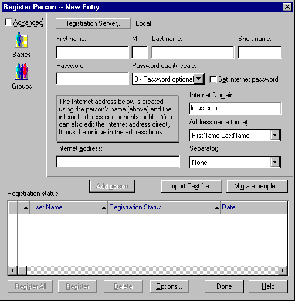
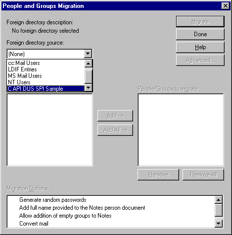
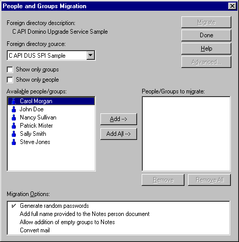
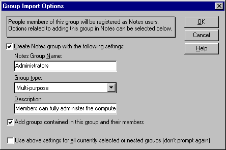

##### Chapter 9-10
##### Domino Upgrade Services (DUS)

<b>Introduction</b> 
 
The DUS SPI  (<i>Domino Upgrade Services/Service Provider Interface</i>) allows developers to develop a Domino Upgrade Service DUS DLL.  This DUS DLL is an extension to the Domino Administration/Registration User Interface.  The DUS DLL can be invoked at the time of User Registration.  Domino Administrators will now have the ability to easily register users from other directories.  Domino provides DUS services which allow user conversion from  cc:Mail, MS Mail, Exchange, Windows 32-bit, or another LDAP directory.  The SPI will allow you to integrate your own migration tool. 
 
This chapter gives an overview of the SPI calls along with an illustration of the sample DUS found under sample directory ...\admin\samples\dussp. 
 
<b>Overview of the SPI calls</b> 
 
The DUS calls are defined in dus.h.  Also refer to the <i>HCL C API Reference</i> for further information. 

<ul type="disc">
<li><b>DUSGetName </b>- Provides a name and description of the DUS at the time the '<i>People and Groups Migration</i>' dialog is displayed.  
<li><b>DUSStart </b>- Signifies that this DUS has either been selected from the '<i>Foreign Directory Source</i> ' source list in the '<i>People and Groups Migration</i>' dialog <u>or</u> registration is about to begin on users selected for this DUS.  Also  '<i>Migration Options</i>' and '<i>Advanced</i>' dialog is done here by setting options defined in <b>fDUSxxx.  </b>Please refer to the <i>HCL C API Reference</i> for further definition of <b>fDUSxxx</b>.  Any secondary UI necessary to gather more information concerning this DUS is handled within <b>DUSStart</b>.  For example, more information may be needed before retrieving all the users/groups pertaining to this DUS.
<li><b>DUSRetrieveUsers </b>- This function allocates and passes back an array of DUS_ENTRY structs containing information about the users available for this migration.
<li><b>DUSRetrieveGroups </b>- This function allocates and passes back an array of DUS_ENTRY structs containing information about the users, within a group, available for this migration.
<li><b>DUSGetUserInformation </b>- This function returns full information about a user/group selected to be migrated.
<li><b>DUSGetGroupInformation </b>- This function returns information about the group selected to be migrated.
<li><b>DUSGetGroupMembers </b>- This function returns membership information about the group.  This function is called after <b>DUSGetGroupInformation.</b>
<li><b>DUSAdvancedDlg </b>- If the flag <b>fDUSAdvancedDlg </b>is passed into <b>DUSStart</b>, then the '<i>Advanced</i>....' button on the <i>'People and Groups Migration</i>' dialog will be highlighted.  When this button is activated <b>DUSAdvancedDlg </b>will be called to display the modal dialog box created for this particular DUS.  This dialog box may ask for specific options relating to this DUS.  
<li><b>DUSRegistrationNotify </b>- Notifies the DUS that Domino User Registration for the user represented by UserName is about to start or has just finished.
<li><b>DUSConvertMailFile </b>- Converts DUS mail into a Domino mail file.
<li><b>DUSExtendedErrorText </b>- This call retrieves the text to be displayed in the event that a call to the DUS extension DLL fails and the DLL wishes to return an error string.
<li><b>DUSStop </b> - Notifies the DUS that this session (started with <b>DUSStart</b>)<b> </b>is over.
<li><b>DUSTerm </b>- Terminates the DUS. 
</ul>
<b>Getting Started</b> 
 
A DUS application involves migrating users/groups from a foreign directory source to a Domino source.  All of the DUS functions will be called by the DUS framework.  However your DUS may not require processing for all the DUS functions.  Keep in mind your DUS application will need to declare all of the DUS functions.  Any DUS function that is not applicable to your application should return NOERROR.  The following is a brief description of the DUS functions which make up a DUS application (please refer to the DUS sample found in the samples directory ..\samples\admin\dusspi): 

<ul type="disc">
<li><b>DUSGetName</b> is essential for passing in a DUS name and description.</ul>
	A resource file would need to be set up for <b>DUSGetName </b>to include, for example : 
		<i>mswin32.rc</i> 
<i>		</i>STRINGTABLE DISCARDABLE 
		BEGIN 
		#include &lt;globerr.h&gt; 
			MSG_DUS_ADDIN_NAME          &quot;C API DUSSPI Sample&quot; 
			MSG_DUS_ADDIN_VERSION    &quot;Version 1.0&quot; 
			STR_DUS_NAME                	&quot;C API DUS SPI Sample&quot; 
			STR_DUS_DESCRIPTION         &quot;C API Domino Upgrade Service Sample&quot; 
		END 
		.... 
 
		<i>duspierr.h</i> 
<i>		</i>/* String 0 must always be the application's task name. 
		    String 1 must be the version. */ 
<i>		</i>#define PKG_DUS						PKG_ADDIN 
		#define MSG_DUS_ADDIN_NAME				(PKG_DUS+0) 
		#define MSG_DUS_ADDIN_VERSION				(PKG_DUS+1) 
		#define STR_DUS_NAME					(PKG_DUS+2) 
		#define STR_DUS_DESCRIPTION				(PKG_DUS+3)		 
		... 
		 
		<i>dusname.c</i>

<i>		</i>DUSGetName(HMODULE hInstance, char *DUSNameBuf, WORD  DUSNameBufLen, char *DUSDescriptionBuf,  
													WORD  DUSDescriptionBufLen)

		{

		...

		OSLoadString(hInstance, STR_DUS_NAME, DUSNameBuf, DUSNameBufLen); 
		OSLoadString(hInstance, STR_DUS_DESCRIPTION, DUSDescriptionBuf, DUSDescriptionBufLen);

		.....

		}
<ul type="disc">
<li><b>DUSStart</b> is essential for starting the DUS.  This is where a DUS context is initialized, a secondary user interface is established and other DUS environment information is set such as the setting of any <b>fDUSxxx</b> flags.  Although not necessary each DUS function allows for a handle to the context of the DUS running.  A DUS Context may include some of the following when set up:</ul>
		<i>dusspi.h</i> 
		typedef struct 
		{ 
			HMODULE			hDUSModule; 
			WORD				ExtendedError; 
			WORD				ExtendedErrorLevel; 
			DUSPROGRESSBARPROC	ProgressBarProc; 
			DUSLOGEVENTPROC		LogEventProc; 
		}DUS_CONTEXT, *PDUS_CONTEXT;  		 
		.... 
	 
		<i>dusspi.c</i> 
<i>		</i>DUSStart(HMODULE  hInstance, HANDLE *pRethContext, NOTEHANDLE  hUserNote, DWORD *pRetStartFlags, 										DUSPROGRESSBARPROC  DUSProgressBar, DUSLOGEVENTPROC  DUSLogEvent) 
		{ 
		... 
			/* This is where the following flags would be set.  
				- fDUSDoMailConversion	 
				- fDUSGenerateRandPWs 
				- fDUSAdvancedDlg 
				- fDUSUseFullNameProvided 
				- fDUSUseMailFileNameProvided 
				- fDUSAllowEmptyGroups 
			*/ 
			/* In our case we want this DUS to: 
				1) generate random passwords 
			*/ 
			*pRetStartFlags = fDUSGenerateRandPWs; 
 
			/* Allocate the DUS Context Buffer. */ 
			pDUSCtx = NULL; 
			size = sizeof(DUS_CONTEXT); 
			if(error = OSMemAlloc(0, size, pRethContext)) 
				pRethContext = NULLHANDLE; 
			else 
			{ 
	 			pDUSCtx = OSLock(DUS_CONTEXT, *pRethContext); 
	 			memset(pDUSCtx, 0, (size)); 
			} 
	  
			pDUSCtx-&gt;hDUSModule = hInstance; 
			pDUSCtx-&gt;ProgressBarProc = DUSProgressBar; 
			pDUSCtx-&gt;LogEventProc = DUSLogEvent; 
			if(pDUSCtx != NULL) 
			{ 
				OSUnlock(*pRethContext); 
				pDUSCtx = NULL; 
			} 
			..... 
			return(error); 
		} 
		 

<ul type="disc">
<li><b>DUSRetrieveUsers </b>and/or <b>DUSRetrieveGroups </b>will be called by the DUS framework to retrieve the people/groups available for migration.  It is not necessary to provide processing for both.  For example you may only be interested in specific users and not groups or the reverse.  This information can come in any form in which your users/groups are stored.  For example the information may come from an input file.  Whatever form the information is in, the DUS application must take that information and fill in a <b>DUS_ENTRY </b>for each user/group that is to be chosen for migration.  </ul>

<ul type="disc">
<li>If you are interested in group information within your DUS application then you may want to provide processing within <b>DUSGetGroupInformation</b>.  A  NOTEHANDLE to a group document is available within <b>DUSGetGroupInformation</b>. This NOTEHANDLE is supplied from the DUS framework.  It is either a NOTEHANDLE to an existing group found in the Domino Directory or it is a NOTEHANDLE to a newly created group just added to  the Domino Directory.  With this NOTEHANDLE to the group it is possible to set certain fields found within a Group. Such as ADMINP_GROUP_TYPE, which defines the type of group, and MAIL_LISTDESCRIPTION_ITEM, which gives a description of the group  Please refer to stdnames.h for some of the field descriptions defined for a Group document.  The DUS framework also supplies a dialog box with<i> 'Group Import Options'</i> which allow the administrator to make changes to any of the group information previously set.</ul>

<ul type="disc">
<li>Along with <b>DUSGetGroupInformation </b>there is  <b>DUSGetGroupMembers</b> which will get called after <b>DUSGetGroupInformation. </b> This is where processing is done to get a list of actual members within the group selected.  The member list will be passed back to the DUS framework via handles to a group members list and a user members list.  The DUS framework will display the group(s) and their member(s) under <i>'People/Groups to migrate'.</i></ul>
<i>		</i>
<ul type="disc">
<li>Once the administrator executes the <i>'Migrate'</i> button then the DUS framework will call <b>DUSGetUserInformation </b>within your DUS.  A NOTEHANDLE to a user note is available to set name, address, etc., for this user about to be migrated.  Refer to stdnames.h , User registration document field definitions.  The users are then added to the registration queue.  <b>DUSStop </b>is called within your DUS to signify this DUS session is over and this would be the time to free up any memory allocated for the DUS context.  This is followed by a call to <b>DUSTerm </b>which allows for any other additional cleanup that may be necessary within your DUS application.</ul>

<ul type="disc">
<li>An optional function to implement within your DUS would be <b>DUSAdvancedDlg</b>.  With this function an additional dialog box can be implemented to support additional information that may be needed when migrating users.  The flag <b>fDUSAdvancedDlg </b>must be set in <b>DUSStart</b> in order for this function to be called within the DUS.  The <i>'Advanced'</i> button on the <i>People and Groups Migration'</i> screen will be enabled.</ul>
 
<b>When Registration Begins</b> 
 
Once registration begins for the users in the registration queue, your DUS application will be started again which allows for additional processing on the user about to be registered.<b>  </b>Therefore when coding <b>DUSStart </b>a check should be made on the NOTEHANDLE passed in.  If the NOTEHANDLE is a NULLHANDLE then the DUS application is being called from the <i>'People and Groups Migration'</i> screen.  Otherwise <b>DUSStart </b>is being called from user registration.  
 
The function which will be called within your DUS application is <b>DUSRegistrationNotify</b>.  The first time the DUS framework calls this function the parameter <i>bAfterEvent</i> will be FALSE.  This will signify registration is about to begin on this user.  When <b>DUSRegistrationNotify </b>is called a second time, the parameter <i>bAfterEvent </i>will be TRUE to signify registration has completed for this user.  Processing within <b>DUSRegistrationNotify </b>allows the DUS to take pre or post registration action to supplement registration-related activity. 
 
The function <b>DUSDoMailFileConversion </b>will be called within your DUS after registration is complete only if the <b>fDUSxxx </b>flag has been set to <b>fDUSDoMailConversion</b>.  This flag along with all other <b>fDUSxxx </b>flags get set in <b>DUSStart.</b> 
 
The registration process finishes up and <b>DUSStop</b> and <b>DUSTerm </b>are called to complete and unload your DUS application. 
 
<b>Error Handling</b> 
 
The function <b>DUSExtendedErrorText </b>is available to handle errors within a DUS application.  There is the option for an information message <b>(DUS_ERROR_LEVEL_INFO)</b>, a warning message <b>(DUS_ERROR_LEVEL_WARNING) </b>or an error message <b>(DUS_ERROR_LEVEL_ERROR)</b>, which allows the shutdown of the DUS application.   
 
To activate the error handling within the DUS framework the DUS application must return a legitimate error.  One such legitimate error would be <b>ERR_DUS_EXTENDED_ERROR</b>, which for most error conditions will be sufficient.  This error is defined in the header file regerr.h.  Another possible error could be <b>ERR_DUS_CONTEXT_CORRUPTED</b>, which is also defined in regerr.h 
 
For a corrupted context handle, all that is necessary to return is the error <b>ERR_DUS_CONTEXT_CORRUPTED</b>.  For all other errors it is necessary to set up parameters <b>ErrorBuffer </b>and <b>pErrorLevel</b>.  <b>ErrorBuffer</b> contains an error string defined within the DUS application and <b>pErrorLevel</b> is the type of error to be displayed (refer to <b>DUS_ERROR_LEVEL_XXX</b> within the API reference guide). 
 
<b>How the DUS is Activated</b> 
 
From '<i>Register Person -- New Entry</i>' there is a '<i>Migrate people....</i>' button which will send you to the '<i>People and Groups Migration</i>' Screen where selection of a DUS is made and the activation of a DUS begins. 
 
 
 
First the notes.ini file will be searched for the environment string 'UpgradeApps'.  'UpgradeApps' will specify the name(s) of the DUS DLL(s), comma delimited if more than one, to be loaded and initialized.  All third party DUS DLLs will need to be referenced in the 'UpgradeApps' environment variable in order to be recognized by Domino. For example: 
 
UpgradeApps=NDUSSPI.DLL 
 
After the 'UpgradeApps' environment variable is read a call to <b>DUSGetName </b>is made for each DUS to provide a name and description of the DUS.   
Since the '<i>NT Users</i>' DUS is part of Domino core there is no need to have the DUS supplied in the 'UpgradeApps' environment variable. 
 
In this example we are selecting the '<i>C API DUS SPI Sample</i>' DUS.   
 
 
 
Once selected <b>DUSStart </b>is called to get any additional information needed for this DUS.  In this case <b>DUSStart </b>is only going to initialize the context for this DUS.  If further information was required then a secondary UI would need to be implemented within <b>DUSStart.</b>  
 
Once <b>DUSStart </b>has successfully completed <b>DUSRetrieveUsers </b>and <b>DUSRetrieveGroups </b>are called allocating an array of <b>DUS_ENTRY</b> structs containing information about the users/groups available for this migration.  This is shown in the display labeled '<i>Available people/groups</i>'.  Also passed into <b>DUSStart </b>is the '<i>Migration Options</i>' <b>fDUSGenerateRandPWs</b> '<i>Generate random passwords</i>' is checked off.  The DUS sample NDUSSPI is only concerned with Users and not groups. 
 
 
 
 
The administrator can now select users/groups to migrate.   
 
If any group is selected the DUS framework will first call <b>DUSGetGroupInformation </b>within your DUS application.  Once processing has completed within <b>DUSGetGroupInformation </b>the DUS framework will display the following screen, which displays the current <i>'Group Import Options'</i>.    From this screen the administrator has the option to make different choices for migration of this group.  Once the administrator completes his/her choices control is brought back to the DUS framework where a call to <b>DUSGetGroupMembers </b>is made to your DUS application.   
 
 
 
 
 
Once all of the users/groups have been selected within the '<i>People and Groups Migration</i>' screen and the administrator activates 'Migrate', the DUS function <b>DUSGetUserInformation </b>will be called to provide all information for each of the users selected for import/registration.  Control is returned back to the '<i>Register Person -- New Entry</i>' screen.  The users/groups selected will be added to the '<i>User Registration Queue</i>' database 'userreg.nsf'.  From there the administrator is all set to register the users.  When the administrator begins registration via the '<i>Register</i>' or '<i>Register All</i>' button, not only will User registration begin but the DUS will be called again to complete the migration of this particular user. 
 

---
