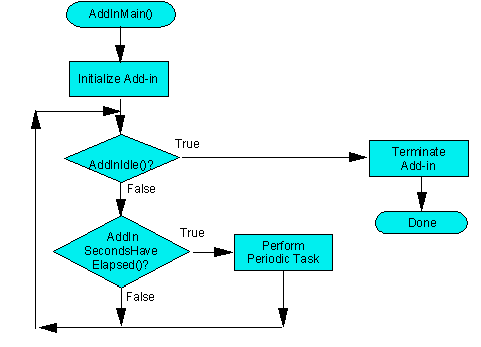
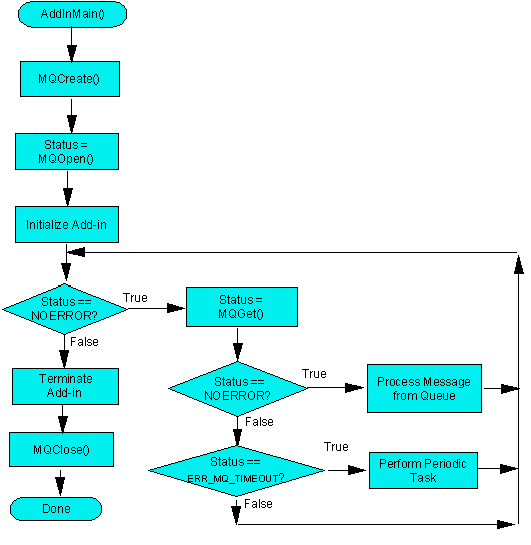

##### Chapter 12-10
##### Message Queues

The Message Queue functions provide a way to send information from one Domino or Notes application to another. 
 
<b>Application Message Queues</b> 
 
One possible use of message queues is to send information from the Domino server console to server add-in tasks. This is implemented by extending the server console TELL command. Starting with Release 4, if any text other than &quot;QUIT&quot; follows the name of the add-in task in the TELL command, the server checks to see if the task has created a message queue. If the message queue exists, the server places the rest of the command in a message and puts the message into that queue. The sample program SAMPLES\SERVER\MSG_Q illustrates this type of operation.  An additional sample program MSG_T in SAMPLES\SERVER\MSG_Q sends messages to the MSG_Q task directly through the message queue the MSG_Q task created. 
 
Message queues are not limited to the server environment. Queues are built using shared memory provided by the Domino and Notes core and do not depend on any platform-specific interprocess communication (IPC) capability. Any Domino or Notes C API application can create a message queue or open a message queue created by another API application and send messages back and forth. While a message queue does not provide the highest performance IPC for any given platform, it does allow applications to use an IPC mechanism that works the same on all Domino and Notes platforms. 
 
Use the MQCreate function (declared in the header file mq.h) to create a message queue. For server add-in tasks that expect to receive commands from the console, the name of the message queue must consist of the prefix TASK_QUEUE_PREFIX followed by the name of the add-in task. For example, the sample program MSG_Q creates a message queue with the name: 

<ul><tt>char MsgQueueName [] = TASK_QUEUE_PREFIX &quot;MSG_Q&quot;;</tt></ul>
 
which uses the implicit string concatenation feature of C to create an array of characters containing the prefix followed by the name of the add-in task, &quot;MSG_Q&quot;. TASK_QUEUE_PREFIX is defined in stdnames.h as &quot;MQ$&quot;, so the name of the queue is actually MQ$MSG_Q. The MQCreate function also has a parameter that can set a limit on the number of messages waiting in the queue.  A non-zero value is used as the limit;  if there are already that many unprocessed messages in the queue, an attempt to put a message into the queue returns an error.  A value of zero indicates that no limit should be placed on the number of messages waiting. 
 
Once you have created the message queue, use the MQOpen function to obtain a handle that is used by the rest of the message queue functions.  Call MQClose to close the queue when you're done with it.  MQPut adds messages to a queue, including a priority value to control the ordering of messages.  MQGet retrieves messages from the queue.  It can either return with an error if there are no messages waiting or wait for a message to be placed in the queue with an optional timeout value.  MQScan provides a powerful additional capability; it invokes a callback function for each message in the queue.  The return value from the callback function determines what happens next: quit the scan, go on to the next message, remove the message from the queue and quit, or remove the message and go on to the next. 
 
Figures 1 and 2 show two different ways to structure a server add-in task. Both examples run a job on the server when a certain number of seconds have elapsed. The flowchart in Figure 1 calls AddInSecondsHaveElapsed in a loop; when this function returns TRUE, the specified time is up and the periodic job is run. One drawback to this design is that the main loop runs continuously;  each time through the loop, the add-in has to check to see if AddInSecondsHaveElapsed returns TRUE.  

 
 
The flowchart in Figure 2 shows how you can implement the same basic process using Message Queues.  MQGet is called inside the loop, with the timeout set to the number of seconds between each run of the periodic job.  If the add-in should quit (either because the server is shutting down or because the operator used the TELL ... QUIT command), MQGet returns ERR_MQ_QUITTING. If a message arrives from another process (for example, the server console), MQGet returns NOERROR and puts the received message into a buffer for the add-in to process.  If the specified number of seconds has elapsed, MQGet returns ERR_MQ_TIMEOUT, indicating that the add-in should run the periodic job.  MQGet only returns when there is something for the add-in to do;  the add-in is not constantly running through the loop, wasting CPU time on checking. 

 
 
The QUIT command receives special handling in Message Queues.  QUIT has higher priority than any other message and sets the message queue to a special quit state. Once a message queue has been told to quit, no more messages can be placed in the queue.  This processing for quit allows a program to create and open a Message Queue and then enter a loop that calls MQGet and processes each message.  When the QUIT command is issued, the next call to MQGet returns the status ERR_MQ_QUITTING, indicating that the program should clean up and quit. 
 
<b>Third-Party Administration Requests</b> 
 
You can extend the Administration Process by creating an Administration Request directed to a third-party server add-in task which interprets the request and acts on it.  When creating a third party Administration Request, you must specify the message queue name used by the server add-in in the ProxyProcess field of the request.  The Administration Process uses this data to pass the request's and response's note IDs to the server add-in.  Also specify the server name where the server add-in task is running in the ProxyServer field of the request.  In the Proxy Action field of the request, put a text version of an identifier, greater than &quot;5000&quot;. 
 
The Administration Process acts on third party requests by oopening the message queue and placing an AdminAddInMessage with the ID of the administration request note and the ID of the log note.  The add-in task monitors the message queue and performs the required processing. 
 
Extensions to the Administration Process should not modify database ACLs because their actions could conflict with the Administration Process' standard ACL modification operations. 
 
The Domino Collector Task Message Queue 
 
The Domino Collect task collects statistics from specified servers.  You can put collection request messages in the Collector task's message queue.  The Collector will return the information you requested by placing  STAT_RETURN_BLOCK structures in your own message queue. 
 
In order to receive the Collector's responses to your request messages, you need to create your own message queue.  
 
You place request messages in the Collector 's message queue via the SERVER_MSG_BLOCK structure.  In this structure, you specify the server that you want to collect information from, the kind of information that you want collected, and the message queue you created in order to receive responses.    See the <i>Reference</i> for details about the SERVER_MSG_BLOCK and STAT_RETURN_BLOCK structures. 
 
To place a message on the Collector's message queue, specify COLLECT_QUEUE_NAME for the QueueName parameter to MQOpen and use MQPut to put your SERVER_MSG_BLOCK structure in this message queue.  The Collector will post the information you requested in your own message queue as STAT_RETURN_BLOCK structures. 
 
To retrieve the Collector's responses from your message queue, specify the address of a STAT_RETURN_BLOCK structure (casted to a char *) for the Buffer parameter to MQGet. 
 
The sample program below demonstrates how to put in collection request messages and how to retrieve the returned response.
<table width="100%" border="1">
<tr valign="top"><td width="100%"><b>coltest.c: Sample Add-In for requesting Collection messages</b></td></tr>
</table>
<tt>/*	This Addin interfaces with the collector task to get information </tt> 
<tt>	on two different servers. */</tt> 
 
<tt>/* C include files */</tt> 
<tt>#include &lt;stdio.h&gt;</tt> 
<tt>#include &lt;stdlib.h&gt;</tt> 
 
<tt>/* C API include files */</tt> 
<tt>#include &quot;global.h&quot;</tt> 
<tt>#include &quot;misc.h&quot;</tt> 
<tt>#include &quot;osmisc.h&quot;</tt> 
<tt>#include &quot;ostime.h&quot;</tt> 
<tt>#include &quot;osmem.h&quot;</tt> 
<tt>#include &quot;addin.h&quot;</tt> 
<tt>#include &quot;event.h&quot;</tt> 
<tt>#include &quot;mq.h&quot;</tt> 
<tt>#include &quot;stats.h&quot;</tt> 
<tt>#include &quot;stdnames.h&quot;</tt> 
<tt>#include &quot;intl.h&quot;</tt> 
<tt>#include &quot;miscerr.h&quot;</tt> 
 
 
<tt>#define COLLECT_TEST_QUEUE_NAME &quot;TestCollect&quot;</tt> 
<tt>#define CHAR_TAB &nbsp; &nbsp;0x09</tt> 
<tt>#define CHAR_LF &nbsp; &nbsp; 0x0a</tt> 
 
<tt>static &nbsp; &nbsp;WORD x;</tt> 
<tt>extern &nbsp; &nbsp;ServerCount = 2;	</tt> 
<tt>static &nbsp; &nbsp;FILE *fd; 	/* File descriptor. */</tt> 
<tt>extern &nbsp; &nbsp;int UserValue[5] = {0,0,0,0,0}; </tt> 
<tt>extern &nbsp; &nbsp;DWORD StartTicks[5] = {0,0,0,0,0};</tt> 
<tt>extern &nbsp; &nbsp;DWORD ElapsedTicks[5] = {0,0,0,0,0};</tt> 
<tt>extern &nbsp; &nbsp;char ServerName[5][MAXSPRINTF] = </tt> 
<tt>&nbsp; &nbsp; &nbsp; &nbsp; &nbsp; &nbsp; &nbsp;{</tt> 
<tt>&nbsp; &nbsp; &nbsp; &nbsp; &nbsp; &nbsp; &nbsp; &nbsp; &nbsp;&quot;Radium&quot;,</tt> 
<tt>&nbsp; &nbsp; &nbsp; &nbsp; &nbsp; &nbsp; &nbsp; &nbsp; &nbsp;&quot;Acare&quot;</tt> 
<tt>&nbsp; &nbsp; &nbsp; &nbsp; &nbsp; &nbsp; &nbsp;};</tt> 
<tt>STATUS far PASCAL ParseStats (char *pServerName, HANDLE hStats, DWORD StatsLength);</tt> 
 
 
<tt>STATUS LNPUBLIC AddInMain (HMODULE hResourceModule, int argc, char *argv[])</tt> 
<tt>/* &nbsp; &nbsp;Main entry point for event add-in</tt> 
<tt>&nbsp;*</tt> 
<tt>&nbsp;*/</tt> 
<tt>{</tt> 
<tt>&nbsp; &nbsp; STATUS error = NOERROR;</tt> 
<tt>&nbsp; &nbsp; char filename[MAXPATH]; &nbsp; &nbsp; &nbsp; &nbsp; &nbsp; &nbsp; &nbsp; &nbsp; &nbsp; &nbsp; &nbsp; &nbsp; &nbsp; &nbsp; /* File name. */</tt> 
<tt>&nbsp; &nbsp; int Minutes = 0;							</tt> 
<tt>&nbsp; &nbsp; char Output[MAXSPRINTF];</tt> 
<tt>&nbsp; &nbsp; TIMEDATE StartTime, EndTime, CurrentTime, LoopTime; /* Time variables. */</tt> 
<tt>&nbsp; &nbsp; char StartTimeText[MAXSPRINTF];</tt> 
<tt>&nbsp; &nbsp; char EndTimeText[MAXSPRINTF];</tt> 
<tt>&nbsp; &nbsp; MQHANDLE hCollectorQueue = NULLHANDLE;</tt> 
<tt>&nbsp; &nbsp; MQHANDLE bMsgQueue = NULLHANDLE;</tt> 
<tt>&nbsp; &nbsp; SERVER_MSG_BLOCK ServerMsg;</tt> 
<tt>	</tt> 
<tt>&nbsp; &nbsp; WORD NameLen = 0; </tt> 
<tt>&nbsp; &nbsp; WORD RandomLen = 0; </tt> 
<tt>&nbsp; &nbsp; WORD CharsLeft = 0;</tt> 
<tt>&nbsp; &nbsp; char TmpRandom[16];</tt> 
<tt>&nbsp; &nbsp; char *pRandom;</tt> 
<tt>&nbsp; &nbsp; char TmpQueueName[20];</tt> 
<tt>	</tt> 
<tt>&nbsp; &nbsp; if (argc &lt; 3)</tt> 
<tt>&nbsp; &nbsp; {</tt> 
<tt>&nbsp; &nbsp; &nbsp; &nbsp; printf(&quot;Invalid parameters\nUse: Load coltest &lt;Filename&gt; &lt;Minutes&gt;\n&quot;);</tt> 
<tt>&nbsp; &nbsp; &nbsp; &nbsp; return(NOERROR);</tt> 
<tt>&nbsp; &nbsp; }</tt> 
 
<tt>&nbsp; &nbsp; /* Log 'We just started' */</tt> 
<tt>&nbsp; &nbsp; AddInLogMsg(MSG_ADDIN_STARTED, NULL);</tt> 
<tt>	</tt> 
<tt>&nbsp; &nbsp; /* Get the filename from param 1*/</tt> 
<tt>&nbsp; &nbsp; strncpy(filename, argv[1], sizeof(filename)-1);</tt> 
 
<tt>&nbsp; &nbsp; fd = fopen (filename, &quot;w+&quot;);</tt> 
<tt>&nbsp; &nbsp; if(fd == NULL)</tt> 
<tt>&nbsp; &nbsp; &nbsp; &nbsp; return(ERR_ADDIN_FOPEN);</tt> 
<tt>	</tt> 
<tt>&nbsp; &nbsp; /* Convert param 2 form ascii to integer (Minutes). */</tt> 
<tt>&nbsp; &nbsp; Minutes = atoi(argv[2]);</tt> 
 
<tt>&nbsp; &nbsp; /* Get my start time. (OSTIME.H) */</tt> 
<tt>&nbsp; &nbsp; OSCurrentTIMEDATE(&amp;StartTime);</tt> 
<tt>&nbsp; &nbsp; EndTime = LoopTime = StartTime;</tt> 
 
<tt>&nbsp; &nbsp; /* Adjust my end time by number of minutes specified in param 2. */</tt> 
<tt>&nbsp; &nbsp; TimeDateAdjust(&amp;EndTime, 0, Minutes, 0, 0, 0, 0);</tt> 
<tt>	</tt> 
<tt>&nbsp; &nbsp; /* Adjust my end time by two of minutes for loop. */</tt> 
<tt>&nbsp; &nbsp; TimeDateAdjust(&amp;LoopTime, 0, 2, 0, 0, 0, 0);</tt> 
<tt>	</tt> 
<tt>&nbsp; &nbsp; /* Convert start time and end time to text, for header. */</tt> 
<tt>&nbsp; &nbsp; ConvertTIMEDATEToText (NULL, NULL, &amp;StartTime, StartTimeText,</tt> 
<tt>&nbsp; &nbsp; &nbsp; &nbsp; &nbsp; &nbsp; &nbsp; &nbsp; &nbsp; &nbsp; &nbsp; &nbsp; &nbsp; &nbsp;sizeof(StartTimeText)-1, NULL);</tt> 
<tt>	</tt> 
<tt>&nbsp; &nbsp; ConvertTIMEDATEToText (NULL, NULL, &amp;EndTime, EndTimeText, </tt> 
<tt>&nbsp; &nbsp; &nbsp; &nbsp; &nbsp; &nbsp; &nbsp; &nbsp; &nbsp; &nbsp; &nbsp; &nbsp; &nbsp; &nbsp;sizeof(EndTimeText)-1, NULL);</tt> 
<tt>&nbsp; &nbsp; /* Write header to text file. */</tt> 
<tt>&nbsp; &nbsp; sprintf(Output, &quot;Users count from %s to %s\n&quot;, StartTimeText, EndTimeText); </tt> 
<tt>&nbsp; &nbsp; fwrite( Output, sizeof(char), strlen(Output), fd );</tt> 
 
<tt>&nbsp; &nbsp; /* Write labels to text files. */</tt> 
<tt>&nbsp; &nbsp; sprintf(Output, &quot;Time/Server&quot;); </tt> 
<tt>&nbsp; &nbsp; for(x = 0; x &lt; ServerCount; x++)</tt> 
<tt>&nbsp; &nbsp; {</tt> 
<tt>&nbsp; &nbsp; &nbsp; &nbsp; char ServerString[MAXSPRINTF];</tt> 
<tt>		</tt> 
<tt>&nbsp; &nbsp; &nbsp; &nbsp; sprintf(ServerString, &quot;,%s&quot;, ServerName[x]); </tt> 
<tt>&nbsp; &nbsp; &nbsp; &nbsp; strcat (Output, ServerString);</tt> 
<tt>&nbsp; &nbsp; }</tt> 
<tt>&nbsp; &nbsp; strcat(Output, &quot;\n&quot;); </tt> 
<tt>&nbsp; &nbsp; fwrite( Output, sizeof(char), strlen(Output), fd );</tt> 
<tt>	</tt> 
<tt>	</tt> 
<tt>getnewname:</tt> 
<tt>&nbsp; &nbsp; /* &nbsp;Create random queuename */</tt> 
 
<tt>&nbsp; &nbsp; NameLen = sprintf(TmpQueueName, &quot;%.11s&quot;, COLLECT_TEST_QUEUE_NAME);</tt> 
<tt>&nbsp; &nbsp; CharsLeft = 16-NameLen;</tt> 
 
<tt>&nbsp; &nbsp; if (CharsLeft)</tt> 
<tt>&nbsp; &nbsp; {</tt> 
<tt>&nbsp; &nbsp; &nbsp; &nbsp; RandomLen = sprintf(TmpRandom, &quot;%08lu&quot;, (DWORD)rand());</tt> 
<tt>&nbsp; &nbsp; &nbsp; &nbsp; pRandom = TmpRandom+RandomLen-CharsLeft;</tt> 
<tt>&nbsp; &nbsp; &nbsp; &nbsp; sprintf(TmpQueueName+NameLen, &quot;%s&quot;, pRandom);</tt> 
<tt>&nbsp; &nbsp; }</tt> 
<tt>		</tt> 
<tt>&nbsp; &nbsp; printf(&quot;Opening queue (%s)\n&quot;, TmpQueueName);</tt> 
<tt>&nbsp; &nbsp; /* create temp queue */</tt> 
<tt>&nbsp; &nbsp; if ((error = MQCreate(TmpQueueName, 128, 0)) == NOERROR)</tt> 
<tt>&nbsp; &nbsp; {</tt> 
<tt>&nbsp; &nbsp; &nbsp; &nbsp; if (error = MQOpen(TmpQueueName, 0, &amp;bMsgQueue))</tt> 
<tt>&nbsp; &nbsp; &nbsp; &nbsp; {</tt> 
<tt>&nbsp; &nbsp; &nbsp; &nbsp; &nbsp; &nbsp; goto done;</tt> 
<tt>&nbsp; &nbsp; &nbsp; &nbsp; }</tt> 
<tt>&nbsp; &nbsp; }</tt> 
<tt>&nbsp; &nbsp; else </tt> 
<tt>&nbsp; &nbsp; {</tt> 
<tt>&nbsp; &nbsp; &nbsp; &nbsp; if(ERR(error) == ERR_DUPLICATE_MQ)</tt> 
<tt>&nbsp; &nbsp; &nbsp; &nbsp; &nbsp; &nbsp; goto getnewname;</tt> 
<tt>&nbsp; &nbsp; &nbsp; &nbsp; &nbsp; &nbsp; bMsgQueue = NULL;</tt> 
<tt>&nbsp; &nbsp; &nbsp; &nbsp; &nbsp; &nbsp; goto done;</tt> 
<tt>&nbsp; &nbsp; &nbsp;}</tt> 
 
<tt>&nbsp; &nbsp; memset(&amp;ServerMsg, 0, sizeof(SERVER_MSG_BLOCK));</tt> 
 
<tt>&nbsp; &nbsp; /* Set up message to put in collect queue */</tt> 
<tt>&nbsp; &nbsp; ServerMsg.Task = GET_STAT_TASK;</tt> 
<tt>&nbsp; &nbsp; sprintf(ServerMsg.StatName, &quot;Server.Users&quot;);</tt> 
<tt>&nbsp; &nbsp; sprintf(ServerMsg.QueueName, &quot;%s&quot;, TmpQueueName);</tt> 
 
<tt>&nbsp; &nbsp; if((error = MQOpen(COLLECT_QUEUE_NAME, 0, &amp;hCollectorQueue)) != NOERROR)</tt> 
<tt>&nbsp; &nbsp; {</tt> 
<tt>&nbsp; &nbsp; &nbsp; &nbsp; printf(&quot;Collector not running.\n&quot;);</tt> 
<tt>&nbsp; &nbsp; &nbsp; &nbsp; error = NOERROR;</tt> 
<tt>&nbsp; &nbsp; &nbsp; &nbsp; goto done;</tt> 
<tt>&nbsp; &nbsp; }</tt> 
<tt>	</tt> 
<tt>&nbsp; &nbsp; /* &nbsp; &nbsp;Main loop.</tt> 
<tt>&nbsp; &nbsp; &nbsp;* &nbsp; &nbsp;AddInIdleDelay checks for quit message, therefore the !</tt> 
<tt>&nbsp; &nbsp; &nbsp;* &nbsp; &nbsp;Check to see if we have reached end time.</tt> 
<tt>&nbsp; &nbsp; &nbsp;*/</tt> 
<tt>&nbsp; &nbsp; while (!AddInIdle())</tt> 
<tt>&nbsp; &nbsp; /* while (!AddInIdleDelay(10) &amp;&amp; TimeDateCompare(&amp;CurrentTime, &amp;EndTime) &lt; 0) */</tt> 
<tt>&nbsp; &nbsp; {</tt> 
<tt>&nbsp; &nbsp; &nbsp; &nbsp; WORD ReturnMsgCount = 0;</tt> 
 
<tt>&nbsp; &nbsp; &nbsp; &nbsp; for(x = 0; x &lt; ServerCount; x++)</tt> 
<tt>&nbsp; &nbsp; &nbsp; &nbsp; {</tt> 
<tt>			</tt> 
<tt>&nbsp; &nbsp; &nbsp; &nbsp; &nbsp; &nbsp; /* Get starting millisecond count ans save */</tt> 
<tt>&nbsp; &nbsp; &nbsp; &nbsp; &nbsp; &nbsp; StartTicks[x] = GetTickCount();</tt> 
<tt>&nbsp; &nbsp; &nbsp; &nbsp; &nbsp; &nbsp; sprintf(ServerMsg.StatServerName, &quot;%s&quot;, ServerName[x]);</tt> 
<tt>&nbsp; &nbsp; &nbsp; &nbsp; &nbsp; &nbsp; if((error = MQPut(hCollectorQueue, NOPRIORITY, (char *)&amp;ServerMsg,</tt> 
<tt>&nbsp; &nbsp; &nbsp; &nbsp; &nbsp; &nbsp; &nbsp; &nbsp; &nbsp; &nbsp; &nbsp; &nbsp; &nbsp; &nbsp; &nbsp; sizeof(SERVER_MSG_BLOCK), 0)) != NOERROR)</tt> 
<tt>&nbsp; &nbsp; &nbsp; &nbsp; &nbsp; &nbsp; {</tt> 
<tt>&nbsp; &nbsp; &nbsp; &nbsp; &nbsp; &nbsp; &nbsp; &nbsp; goto done;</tt> 
<tt>&nbsp; &nbsp; &nbsp; &nbsp; &nbsp; &nbsp; }</tt> 
<tt>&nbsp; &nbsp; &nbsp; &nbsp; }</tt> 
<tt>	</tt> 
<tt>Next:</tt> 
<tt>&nbsp; &nbsp; &nbsp; &nbsp; /* Get the current time to compare against */</tt> 
<tt>&nbsp; &nbsp; &nbsp; &nbsp; OSCurrentTIMEDATE(&amp;CurrentTime);</tt> 
<tt>		</tt> 
<tt>&nbsp; &nbsp; &nbsp; &nbsp; if(MQGet(bMsgQueue, (char*) &amp;pRtnMsg, sizeof(STAT_RETURN_BLOCK), 0, 0, NULL) != </tt> 
<tt>&nbsp; &nbsp; &nbsp; &nbsp; &nbsp; &nbsp;ERR_MQ_EMPTY)</tt> 
<tt>&nbsp; &nbsp; &nbsp; &nbsp; {</tt> 
<tt>&nbsp; &nbsp; &nbsp; &nbsp; &nbsp; &nbsp; if(!pRtnMsg.error)</tt> 
<tt>&nbsp; &nbsp; &nbsp; &nbsp; &nbsp; &nbsp; {</tt> 
<tt>&nbsp; &nbsp; &nbsp; &nbsp; &nbsp; &nbsp; &nbsp; &nbsp; ParseStats(pRtnMsg.ServerName, pRtnMsg.hStatName, pRtnMsg.StatNameSize);</tt> 
<tt>&nbsp; &nbsp; &nbsp; &nbsp; &nbsp; &nbsp; &nbsp; &nbsp; ReturnMsgCount++;</tt> 
<tt>&nbsp; &nbsp; &nbsp; &nbsp; &nbsp; &nbsp; } &nbsp; </tt> 
<tt>&nbsp; &nbsp; &nbsp; &nbsp; &nbsp; &nbsp; else</tt> 
<tt>&nbsp; &nbsp; &nbsp; &nbsp; &nbsp; &nbsp; {</tt> 
<tt>&nbsp; &nbsp; &nbsp; &nbsp; &nbsp; &nbsp; &nbsp; &nbsp; char szString[256];</tt> 
<tt>&nbsp; &nbsp; &nbsp; &nbsp; &nbsp; &nbsp; &nbsp; &nbsp; OSLoadString( NULLHANDLE, pRtnMsg.error, szString, sizeof(szString)-1);</tt> 
<tt>&nbsp; &nbsp; &nbsp; &nbsp; &nbsp; &nbsp; &nbsp; &nbsp; printf( &quot;\tError = %s\n&quot;, szString );				</tt> 
<tt>&nbsp; &nbsp; &nbsp; &nbsp; &nbsp; &nbsp; &nbsp; &nbsp; printf(&quot;Error contacting %s.\n&quot;, pRtnMsg.ServerName);</tt> 
<tt>&nbsp; &nbsp; &nbsp; &nbsp; &nbsp; &nbsp; &nbsp; &nbsp; ReturnMsgCount++;</tt> 
<tt>&nbsp; &nbsp; &nbsp; &nbsp; &nbsp; &nbsp; }</tt> 
<tt>&nbsp; &nbsp; &nbsp; &nbsp; }</tt> 
 
<tt>&nbsp; &nbsp; &nbsp; &nbsp; /* Did I get messages back from all 5 servers. */</tt> 
<tt>&nbsp; &nbsp; &nbsp; &nbsp; if(!AddInIdleDelay(1) &amp;&amp; ReturnMsgCount &lt; ServerCount)</tt> 
<tt>&nbsp; &nbsp; &nbsp; &nbsp; &nbsp; &nbsp; goto Next; </tt> 
<tt>		</tt> 
<tt>&nbsp; &nbsp; &nbsp; &nbsp; ReturnMsgCount = 0;</tt> 
<tt>&nbsp; &nbsp; &nbsp; &nbsp; ConvertTIMEDATEToText (NULL, NULL, &amp;CurrentTime, EndTimeText,</tt> 
<tt>&nbsp; &nbsp; &nbsp; &nbsp; &nbsp; &nbsp; &nbsp; &nbsp; &nbsp; &nbsp; &nbsp; &nbsp; &nbsp; &nbsp; &nbsp; &nbsp;sizeof(EndTimeText)-1, NULL);</tt> 
<tt>&nbsp; &nbsp; &nbsp; &nbsp; sprintf(Output, &quot;%s&quot;, EndTimeText);</tt> 
<tt>&nbsp; &nbsp; &nbsp; &nbsp; for(x = 0; x &lt; ServerCount; x++)</tt> 
<tt>&nbsp; &nbsp; &nbsp; &nbsp; {</tt> 
<tt>&nbsp; &nbsp; &nbsp; &nbsp; &nbsp; &nbsp; char OutString[MAXSPRINTF];</tt> 
<tt>			</tt> 
<tt>&nbsp; &nbsp; &nbsp; &nbsp; &nbsp; &nbsp; sprintf(OutString, &quot;,%d&quot;, UserValue[x]); </tt> 
<tt>&nbsp; &nbsp; &nbsp; &nbsp; &nbsp; &nbsp; strcat (Output, OutString);</tt> 
<tt>&nbsp; &nbsp; &nbsp; &nbsp; &nbsp; &nbsp; sprintf(OutString, &quot;,%d&quot;, ElapsedTicks[x]); </tt> 
<tt>&nbsp; &nbsp; &nbsp; &nbsp; &nbsp; &nbsp; strcat (Output, OutString);</tt> 
<tt>&nbsp; &nbsp; &nbsp; &nbsp;}</tt> 
<tt>&nbsp; &nbsp; &nbsp; &nbsp; strcat(Output, &quot;,&quot;);</tt> 
<tt>&nbsp; &nbsp; &nbsp; &nbsp; strcat(Output, EndTimeText);</tt> 
<tt>&nbsp; &nbsp; &nbsp; &nbsp; for(x = 0; x &lt; ServerCount; x++)</tt> 
<tt>&nbsp; &nbsp; &nbsp; &nbsp; {</tt> 
<tt>&nbsp; &nbsp; &nbsp; &nbsp; &nbsp; &nbsp; char OutString[MAXSPRINTF];</tt> 
<tt>&nbsp; &nbsp; &nbsp; &nbsp; }</tt> 
<tt>&nbsp; &nbsp; &nbsp; &nbsp; strcat(Output, &quot;\n&quot;);</tt> 
 
<tt>&nbsp; &nbsp; &nbsp; &nbsp; fwrite( Output, sizeof(char), strlen(Output), fd );</tt> 
<tt>&nbsp; &nbsp; &nbsp; &nbsp; /* Wait two minutes */</tt> 
<tt>&nbsp; &nbsp; &nbsp; &nbsp; while(TimeDateCompare(&amp;CurrentTime, &amp;LoopTime) &lt; 0)</tt> 
<tt>&nbsp; &nbsp; &nbsp; &nbsp; {</tt> 
<tt>&nbsp; &nbsp; &nbsp; &nbsp; &nbsp; &nbsp; OSCurrentTIMEDATE(&amp;CurrentTime);</tt> 
<tt>&nbsp; &nbsp; &nbsp; &nbsp; &nbsp; &nbsp; if(AddInIdleDelay(1))</tt> 
<tt>&nbsp; &nbsp; &nbsp; &nbsp; &nbsp; &nbsp; &nbsp; &nbsp; break;</tt> 
<tt>&nbsp; &nbsp; &nbsp; &nbsp; }</tt> 
<tt>&nbsp; &nbsp; &nbsp; &nbsp; LoopTime = CurrentTime;</tt> 
<tt>&nbsp; &nbsp; &nbsp; &nbsp; /*</tt><tt>&nbsp;Adjust my end time by two of minutes for loop. (MISC.H) */</tt> 
<tt>&nbsp; &nbsp; &nbsp; &nbsp; TimeDateAdjust(&amp;LoopTime, 0, 2, 0, 0, 0, 0);</tt> 
<tt>&nbsp; &nbsp; }</tt> 
<tt>	</tt> 
<tt>done:</tt> 
<tt>&nbsp; &nbsp; if(hCollectorQueue)</tt> 
<tt>&nbsp; &nbsp; &nbsp; &nbsp; MQClose(hCollectorQueue, 0);</tt> 
<tt>	</tt> 
<tt>&nbsp; &nbsp; if(bMsgQueue)</tt> 
<tt>&nbsp; &nbsp; &nbsp; &nbsp; MQClose(bMsgQueue, 0);</tt> 
<tt>	</tt> 
<tt>&nbsp; &nbsp; /* Write event counts prefixed with Type label. */</tt> 
<tt>&nbsp; &nbsp; fclose(fd);</tt> 
<tt>	</tt> 
<tt>&nbsp; &nbsp; /* Log 'We are shuting down'. &nbsp;(ADDIN.H) */</tt> 
<tt>&nbsp; &nbsp; AddInLogMsg(MSG_ADDIN_TERMINATING, NULL);</tt> 
<tt>	</tt> 
<tt>&nbsp; &nbsp; return(error);</tt> 
<tt>}</tt> 
 
<tt>STATUS far PASCAL ParseStats (char *pServerName, HANDLE hStats, DWORD StatsLength)</tt> 
 
<tt>/* &nbsp; &nbsp;Parse the hStats buffer &nbsp;*/</tt> 
 
<tt>{</tt> 
 
<tt>&nbsp; &nbsp; char *p, *pValue;</tt> 
<tt>&nbsp; &nbsp; WORD ValueLength;</tt> 
<tt>&nbsp; &nbsp; char NumberValue[MAXSPRINTF];</tt> 
 
<tt>&nbsp; &nbsp; p = OSLockObject(hStats);</tt> 
<tt>&nbsp; &nbsp; printf(&quot;%s\n&quot;, pServerName);</tt> 
 
<tt>&nbsp; &nbsp; /* Parse stats into Facility, StatName and Value */</tt> 
<tt>&nbsp; &nbsp; while (StatsLength)</tt> 
<tt>&nbsp; &nbsp; {</tt> 
<tt>&nbsp; &nbsp; &nbsp; &nbsp; BOOL PuntuationStripped = FALSE;</tt> 
<tt>		</tt> 
<tt>&nbsp; &nbsp; &nbsp; &nbsp; pValue = strchr(p, CHAR_TAB);</tt> 
<tt>&nbsp; &nbsp; &nbsp; &nbsp; if (pValue == NULL)</tt> 
<tt>&nbsp; &nbsp; &nbsp; &nbsp; &nbsp; &nbsp; break;</tt> 
 
<tt>&nbsp; &nbsp; &nbsp; &nbsp; pValue++;</tt> 
<tt>&nbsp; &nbsp; &nbsp; &nbsp; StatsLength -= (WORD) (pValue - p + 1);</tt> 
<tt>&nbsp; &nbsp; &nbsp; &nbsp; p = strchr(pValue, CHAR_LF);</tt> 
<tt>&nbsp; &nbsp; &nbsp; &nbsp; if (p == NULL)</tt> 
<tt>&nbsp; &nbsp; &nbsp; &nbsp; break;</tt> 
 
<tt>&nbsp; &nbsp; &nbsp; &nbsp; /* Parse the value to store in array */</tt> 
<tt>&nbsp; &nbsp; &nbsp; &nbsp; ValueLength = (WORD) (p - pValue);</tt> 
<tt>&nbsp; &nbsp; &nbsp; &nbsp; p++;</tt> 
<tt>&nbsp; &nbsp; &nbsp; &nbsp; StatsLength -= ValueLength+1;</tt> 
 
<tt>&nbsp; &nbsp; &nbsp; &nbsp; sprintf(NumberValue, &quot;%.*s&quot;, ValueLength, pValue);</tt> 
<tt>&nbsp; &nbsp; &nbsp; &nbsp; for(x = 0; x &lt; ServerCount; x++)</tt> 
<tt>&nbsp; &nbsp; &nbsp; &nbsp; {</tt> 
<tt>&nbsp; &nbsp; &nbsp; &nbsp; &nbsp; &nbsp; /* Save user value to correct spot in array */</tt> 
<tt>&nbsp; &nbsp; &nbsp; &nbsp; &nbsp; &nbsp; if(_stricmp (pServerName, ServerName[x]) == 0)</tt> 
<tt>&nbsp; &nbsp; &nbsp; &nbsp; &nbsp; &nbsp; {</tt> 
<tt>&nbsp; &nbsp; &nbsp; &nbsp; &nbsp; &nbsp; &nbsp; &nbsp; UserValue[x] = atoi(NumberValue);</tt> 
<tt>&nbsp; &nbsp; &nbsp; &nbsp; &nbsp; &nbsp; &nbsp; &nbsp; ElapsedTicks[x] = GetTickCount() - StartTicks[x];</tt> 
<tt>&nbsp; &nbsp; &nbsp; &nbsp; &nbsp; &nbsp; &nbsp; &nbsp; break;</tt> 
<tt>&nbsp; &nbsp; &nbsp; &nbsp; &nbsp; &nbsp; }</tt> 
<tt>&nbsp; &nbsp; &nbsp; &nbsp; }</tt> 
<tt>&nbsp; &nbsp; }</tt> 
<tt>	</tt> 
<tt>&nbsp; &nbsp; OSUnlockObject(hStats);</tt> 
<tt>&nbsp; &nbsp; OSMemFree(hStats);</tt> 
<tt>&nbsp; &nbsp; return(NOERROR);</tt> 
<tt>}</tt>
---
