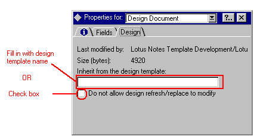

##### Chapter 12-14
##### Remote LAN Access Product Adapter

<b>Introduction</b> 
 
<b>Overview</b> 
 
This chapter describes how to write an adapter to go between Notes and a remote access product. This allows Notes users to use a remote access product other than Microsoft Remote Access Service (RAS) or AppleTalk Remote Access (ARA). Examples of other remote access products include Lan Distance, NetWare Connect, and Shiva. 
 
The adapter, which is referred to here as an RLAN adapter, must be a DLL or shared object.  It must reside in the Notes executable directory.  
 
The use of this adapter requires a modification to the Server Connection document of type Remote LAN Service in the user's Address Book.  You must add an option corresponding to the new remote access service type and provide fields to store any required parameters.  To do this, you must create a new subform and add it to the user's Address Book, as described in the next section.  After you add the subform, you can create a Server Connection document, select Remote LAN Service as the Connection Type, and select your remote access method as the service type. 
 
Release 4 of Notes supported Version 0 of the Remote LAN interface.  Release 5 of Notes supports Version 1 of the Remote LAN interface.  This chapter documents Version 1.  Additional entry points have been added since version 0 and the form of the connection document subform has been redefined.  Connection documents created to version 0 of the interface should still function in this new definition. 
 
<b>Creating a Remote LAN Service Subform</b> 
 
To make a new, different, or modified remote LAN technique available to end users, you must create a new subform and add it to the users' Address Book. This subform must include the full name of the adapter and an abbreviated name that matches the adapter's filename. Follow these steps to create the subform: 
 
1.  Open the Address book and select Create - Design - Subform to open the subform design window. 
 
2.	Select  Design - Subform Properties to open the Subform infobox. 
 
3.	Enter the name of the new subform. The subform name must be made up of three parts, separated by vertical bars:
<ul>
<ul>
<ul type="disc">
<li>$RLAN, followed by the driver name (without a platform prefix)
<li>The descriptive string displayed to users when they open the Connection document and choose a Remote LAN Service type
<li>The driver name (without platform prefix)</ul>
</ul>
</ul>

<ul> 
For example: 

<ul>$RLANRAS | Microsoft Remote Access Service | RAS 
</ul>
</ul>
4.	The subform must consist of ten fields, consisting of five pairs of fields. Each pair consists of a static text field and its associated user input field, as described below:   

<ul>
<ul>
<ul type="disc">
<li>The first five fields must be called StaticTag, Static1, Static2, Static3, and Static4. Even if you don't use all the fields, each must be present and must contain the following type of formula: 
- the driver name (without platform prefix), followed by  
- the three characters &quot;$%^&quot;, followed by  
- the string representing the static text you want to display for each of the input values 
 
If you do not have any text to display, the formula still must contain the name of the driver and the three characters. For example: 
 
&quot;ARA$%^Connection document location:&quot; 
&quot;RAS$%^&quot; 
 
The static fields should be hidden on the subform and appear above the layout region. 

<li>The second five fields must be called RLANTag, RLAN1, RLAN2, RLAN3, and RLAN4. These fields should be placed in a layout region that contains at least these five fields plus the same static text used in the the static fields describing the input fields (see above). There are no restrictions on the default, input translation, or validation formulas for the input fields. As with the static fields, even if you don't need five input fields, each must be on the subform. If you do not need the user to input any data into one of the input fields, it can be hidden.  
</ul>
</ul>
</ul>
5.	The subform and the driver must be installed on the machine that will use the Remote LAN Access Product. Note that for the user to fill out a connection record, only the subform is required.  
 
6.	Check &quot;Do not allow design refresh/replace to modify&quot; to ensure that the subform is not deleted when  Design Replace or Refresh is run on the Address Book.  As an alternative, you can specify a different template to inherit from instead of the standard  Address book design template.
 

 
			 
The following sections list the API calls designed for the RLAN adapter and show a pseudocode program of an example adapter.  
 
 
<b>Header Files</b> 
 
The RLAN adapter may require the following HCL C API header files for Domino and Notes: 
 
#include &quot;global.h&quot;  
#include &quot;misc.h&quot; 
#include &quot;net.h&quot; 
#include &quot;neterr.h&quot; 
#include &quot;oserr.h&quot; 
#include &quot;osmisc.h&quot; 
 
<b>Required Adapter Functions</b> 
 
The RLAN adapter must define two functions that Notes will call. The first function is an initialization routine that registers the adapter with Notes by providing the address of the second function. The second function provides a single entry point to perform all other functions of this adapter. 
 
Under Windows, any legal function name is valid for the initialization function. Under Windows, you must declare the function in the EXPORTS section of the add-in's module definition (.DEF) file and assign it an ordinal value of 1. Notes calls this function by using the ordinal value of 1. 
 
The second function may have any legal function name and need not be assigned an ordinal value, since Notes will use its address to call this function. 
 
<b>MainEntryPoint</b> 
STATUS LNCALLBACK MainEntryPoint( 
<b>	</b>WORD<b> </b> *pVersion, 
<b>	</b>PREMOTE_LAN_SERVICE_ENTRY <b> </b>*rtnGeneralEntryPoint, 
	PREMOTE_LAN_STATUS_CALLBACK <b> </b>Callback) 
 
This initializes the Notes interface. It receives and records the status callback function address and returns the address of the general entry point (the entry point that performs all other functions) to this DLL or shared object. It is called once for each process in which Remote LAN is used. 
 
 
<b>Inputs:</b> 
pVersion	Pointer to a location containing the Remote LAN  version supported by the calling version of Notes. Notes release 4.5 and 4.6 support Remote LAN Version 0.  Notes Release 5 support Version 1. 
 
Callback	Address of a routine in Notes to call from the adapter to report ongoing status (see StatusDisplayCallback below). 
 
<b>Outputs:</b> 
pVersion	Address in which to return the Remote LAN version supported by this adapter. Notes will adapt its expectations to this version. It must be equal to or less than the value supplied by Notes. 
 
*rtnGeneralEntryPoint	Address in which to return the general entry point  for all other calls to this DLL or shared object. 
 
 
(routine)	A Notes error code.  Return NOERROR if no error has occurred. 
 
 
<b>GeneralEntryPoint</b> 
STATUS LNCALLBACK GeneralEntryPoint( 
<b>	</b>VARARG_PTR ap) 
 
This is the single entry point to perform all functions of this interface. The first five parameters are standard. They are the same for all types of calls (as determined by the Type parameter; see below). After the standard parameters, there may be additional parameters specific to the particular action being performed. The interpretation of the additional parameters is a function of the remote LAN service.  
 
<b>Inputs:</b> 
These standard parameters must appear in the order shown below. 
 
WORD Type	Type of action to perform:
<ul>
<ul>
<ul>
<ul>
<ul>
<ul>REMOTE_LAN_SERVICE_CONNECT dials the connection (or skips dialing if already connected).  
 
REMOTE_LAN_SERVICE_DISCONNECT hangs up the connection (or skips hanging up if the connection is already terminated). 
 
REMOTE_LAN_SERVICE_CHECK_CONNECTED checks whether a connection already exists. If currently connected, returns (STATUS) 1. If not connected, returns (STATUS) 0. (The native error code and message text are ignored.) 
 
REMOTE_LAN_SERVICE_GET_EXISTING_LINKS returns (if possible) a list of existing connections to this RLAN program. The list is a single string with entries separated by tab characters. Before creating this string, the adapter program must convert the names from the native character set to Domino multibyte character set.  The list is copied into the error buffer supplied by Notes RLAN when this call is made.  Many dialers can't provide this information.  In this case (if connected to anything), return one string entry with the value, &quot;(Unknown)&quot;.</ul>
</ul>
</ul>
</ul>
</ul>
</ul>

<ul>
<ul>
<ul>
<ul>
<ul>
<ul>REMOTE_LAN_SERVICE_TERMINATE performs any needed one-time termination functions. This is called once for each process that called the INIT entry point. 
 
REMOTE_LAN_SERVICE_GET_DIAL_ENTRY_INFO  returns the phone number, area code and country code from the native dial entry information. This is not supported by Version 0 of the Remote LAN interface.  It is supported by Version 1 of the Remote LAN interface. 
 
REMOTE_LAN_SERVICE_CREATE_DIAL_ENTRY_DIALOG causes the native dialer to bring up a dialog which allows the user to create a dial information entry. This is not supported by Version 0 of the Remote LAN interface. It is supported by Version 1 of the Remote LAN interface. 
 
REMOTE_LAN_SERVICE_GET_DIAL_ENTRY_LIST  returns a tab-separated list of native dial entries. This is not supported by Version 0 of the Remote LAN interface. It is supported by Version 1 of the Remote LAN interface. 
</ul>
</ul>
</ul>
</ul>
</ul>
</ul>
 
DWORD *pNativeError	Place to store native error code. 
 
DWORD *pConnectionHandle	 
	Address of native handle of the connection (to put to or get from, depending on the type). 
 
char *pErrorBuffer	Place to store error messages for display and logging by Notes. Note that if type is REMOTE_LAN_SERVICE_TERMINATE, this address will be NULL. 
 
WORD ErrorBufferSize	Size of error buffer supplied. 
 
<b>Additional arguments</b> 
for REMOTE_LAN_SERVICE_CONNECT:
<ul>char *pEntryName	Name of native dial information entry.  
char *pLoginName	Name to use to login to the remote network. 	 
char *pPassword	Password to use to login to the remote network.	 
char *pPhoneNo	Phone number to dial.	 
char *pDialbackNo	Phone number for the remote access server to call back to to complete the connection. 	</ul>
 
for REMOTE_LAN_SERVICE_DISCONNECT:
<ul>char *pEntryName	Name of native dial information entry. </ul>
 
for REMOTE_LAN_SERVICE_CHECK_CONNECTED<b>:</b>
<ul>char *pEntryName	Name of native dial information entry. </ul>
 
for REMOTE_LAN_SERVICE_GET_EXISTING_LINKS
<ul>None.</ul>
 
for REMOTE_LAN_SERVICE_TERMINATE 
<ul>None.</ul>
 
for REMOTE_LAN_SERVICE_GET_DIAL_ENTRY_INFO 
<ul>char *pPhoneNo	For return of the  phone number in the dial entry. 
char *pAreaCode	For return of the  area code in the dial entry. 
char *pCountryCode	For return of the country code in the dial entry. 
WORD	Size of each of the previous three buffers.</ul>
 
for REMOTE_LAN_SERVICE_CREATE_DIAL_ENTRY_DIALOG 
<ul>None. 
</ul>
for REMOTE_LAN_SERVICE_GET_DIAL_ENTRY_LIST
<ul>char *pReturnBuffer	For return of tab-separated list of dial entry names, terminated by zero. 
WORD BufSize	Size of storage allocated in the return buffer 
WORD *BufCount	Number of characters returned, including the Null terminator.</ul>
 
Note that all strings passed to the adapter and returned from the adapter are stored in multibyte character (LMBCS) format. To convert these to and from a format acceptable to the operating system, the program must use the OSTranslate function. 
 
<b>Outputs:</b> 
pConnectionHandle	Address for returning the native handle of the connection after a successful connect (used for call of type REMOTE_LAN_SERVICE_CONNECT). 
 
pErrorBuffer	Return error string in buffer at this address. 
 
(routine)	Notes error code. The following error codes have special meaning for dial-up connections:
<ul>
<ul>
<ul>
<ul>
<ul>
<ul>NOERROR 
ERR_DEVICE_IN_USE 
ERR_CANCEL   (that is, the user has aborted) 
ERR_REMOTE_BUSY 
ERR_NO_ANSWER 
ERR_NO_CARRIER 
ERR_NO_DIALTONE 
 
For all other error conditions, use: 
ERR_REMOTE_LAN_ERROR</ul>
</ul>
</ul>
</ul>
</ul>
</ul>
 
 
<b>Using the Notes Callback to Display Connection Process Status</b> 
 
For connections that can proceed asynchronously, Notes provides a callback function for use in reporting ongoing status and to detect a user abort from within Notes. This callback capability is not required, but may be useful for asynchronous connections. This function's address is provided in the call to the RLAN adapter's initialization function. Below is an outline of the function: 
 
BOOL LNCALLBACK StatusDisplayCallback( 
	WORD  Action, 
	STATUS  StatusCode, 
	char  *pErrText) 
 
The RLAN adapter calls this function when it wants Notes to display status or error information. It also checks for a user abort condition. The adapter can call this function on a thread that is different from the one on which Notes called the adapter. In this case, Notes must be told about the new thread. Therefore, before any status messages can be displayed, the adapter must call this function with the Action REMOTE_LAN_INIT_THREAD. Once the connection has been made (or has failed), it must be called with the Action REMOTE_LAN_TERM_THREAD. The initialize and terminate calls may be made any number of times for a thread, but the number of termination calls must match the number of initialization calls before the thread is terminated. 
 
<b>Inputs:</b> 
Action	The type of operation needed. Possible values are:
<ul>
<ul>
<ul>
<ul>
<ul>
<ul>REMOTE_LAN_INIT_THREAD	 
Make sure this thread is known to Notes. 
 
REMOTE_LAN_TERM_THREAD	 
Decrement the Notes use count on this thread. 
 
REMOTE_LAN_DISPLAY_STATUS   	 
Map a remote LAN status code to a Notes status message and display it. 
 
REMOTE_LAN_CHECK_ABORT	 
Check user abort condition. 
 
REMOTE_LAN_DISPLAY_ERR0R_TEXT	 
Display an error message in the language provided by the remote LAN service. </ul>
</ul>
</ul>
</ul>
</ul>
</ul>
 
StatusCode	A Remote LAN status code, if  type is  REMOTE_LAN_DISPLAY_STATUS (see below) 
 
pErrText        	The error string, if  type is  REMOTE_LAN_DISPLAY_ERROR_TEXT. 
 
<b>Outputs:</b> 
(routine)	The return argument is of type BOOL. This is used to return an abort condition if one has occurred. It should be TRUE (1) if operation should continue, and FALSE (0) if the user has asked for an abort (e.g. ctl+break for a PC). 
 
<b>Status codes:</b> 
Status codes that are handled are defined in net.h. They are: 
 
REMOTE_LAN_STATUS_STARTING_CONNECTION 
REMOTE_LAN_STATUS_PHYSICALLY_CONNECTED 
REMOTE_LAN_STATUS_AUTHENTICATING 
REMOTE_LAN_STATUS_AUTHENTICATED 
REMOTE_LAN_STATUS_WAITING_FOR_CALLBACK 
REMOTE_LAN_STATUS_LINK_ESTABLISHED 
REMOTE_LAN_STATUS_LINK_FAILED 
REMOTE_LAN_STATUS_HANGING_UP 
REMOTE_LAN_STATUS_HANGUP_COMPLETE 
 
 
<b>Sketch of a Remote LAN Adapter</b> 
 
<tt>/* Notes interface to an external remote access capability &nbsp;*/</tt> 
 
<tt>/* This module interfaces the Notes Remote LAN capability to an external remote 
 &nbsp; access capability. The DLL is explicitly loaded by Notes and once loaded by 
 &nbsp; a Notes process, the initialization function (MainEntryPoint) is called. 
 &nbsp; Thereafter, calls to this module are made to the standard entry point 
 &nbsp; (GeneralEntryPoint). &nbsp;Upon termination, the last process calls 
 &nbsp; the standard entry point to allow any needed termination activity, and the 
 &nbsp; library is unloaded by Notes. </tt> 
 
<tt>&nbsp; &nbsp;This file is pseudo-code and is intended to explain how the Remote LAN 
 &nbsp; interface works. &nbsp;It is laid out with this purpose in mind. Some 
 &nbsp; declarations have been abbreviated or left out. It will not compile or 
 &nbsp; execute. 
*/</tt> 
 
 
<tt>/* Needed C API header files */</tt> 
 
<tt>#include &quot;global.h&quot;  
#include &quot;misc.h&quot; 
#include &quot;net.h&quot; 
#include &quot;neterr.h&quot; 
#include &quot;oserr.h&quot; 
#include &quot;osmisc.h&quot;</tt> 
 
<tt>#define ThisInterfaceVersion 1 &nbsp; &nbsp;/* (This has been increased by 1 from Notes R4)</tt> 
 
<tt>/* 
MainEntryPoint</tt> 
 
<tt>&nbsp; &nbsp;This initializes the Notes interface. &nbsp;It records the status 
 &nbsp; callback function address, and returns the address of the standard entry 
 &nbsp; point to this DLL. It is called once for each process that Remote LAN is 
 &nbsp; used in.</tt> 
 
<tt>&nbsp;Inputs: 
 &nbsp; *pVersion &nbsp; &nbsp; &nbsp; &nbsp; Version number currently provided by Notes. 
 &nbsp; Callback &nbsp; &nbsp; &nbsp; &nbsp; &nbsp;Address of a routine to call to report ongoing  
 &nbsp; &nbsp; &nbsp; &nbsp; &nbsp; &nbsp; &nbsp; &nbsp; &nbsp; &nbsp; status.</tt> 
 
<tt>&nbsp;Outputs:</tt> 
 
<tt>&nbsp; &nbsp;*rtnGeneralEntryPoint &nbsp; The entry point for normal calls to this DLL. 
 &nbsp; (routine) &nbsp; &nbsp; &nbsp; &nbsp; &nbsp; &nbsp; &nbsp; Notes error code 
*/</tt> 
 
 
<tt>STATUS LNCALLBACK MainEntryPoint( 
 &nbsp; WORD *pVersion, 
 &nbsp; PREMOTE_LAN_SERVICE_ENTRY *rtnGeneralEntryPoint, 
 &nbsp; PREMOTE_LAN_STATUS_CALLBACK Callback) 
{ 
 &nbsp; STATUS error = NOERROR;</tt> 
 
<tt>&nbsp; &nbsp;/* Negotiate the version number (example) */ 
 &nbsp; VersioninUse = MIN(*pVersion, ThisInterfaceVersion); 
 &nbsp; *pVersion = VersioninUse;</tt> 
 
<tt>&nbsp; &nbsp;/* &nbsp; &nbsp;If you return zero for the version, Notes will make calls and expect 
 &nbsp; &nbsp; &nbsp; &nbsp; return values appropriate to Notes R4. */</tt> 
 
 
<tt>&nbsp; &nbsp;*rtnGeneralEntryPoint = (PREMOTE_LAN_SERVICE_ENTRY) GeneralEntryPoint; 
 &nbsp; StatusCallback = Callback;</tt> 
 
<tt>&nbsp; &nbsp;/* Load required modules as necessary. */</tt> 
 
<tt>&nbsp; &nbsp;/* Perform one-time initializations. */</tt> 
 
<tt>&nbsp; &nbsp;/* Set error = ERR_REMOTE_LAN_NOT_INSTALLED if unable to initialize. */</tt> 
 
<tt>&nbsp; &nbsp;return error; 
}</tt> 
 
<tt>/* 
GeneralEntryPoint</tt> 
 
<tt>&nbsp; &nbsp;This is the single entry point to perform all the functions of this 
 &nbsp; interface. &nbsp;It is called with a standard first 5 parameters, which 
 &nbsp; are the same for &nbsp;all types of call (as determined by the Type parameter) 
 &nbsp; After the standard parameters there may be additional ones specific to the 
 &nbsp; particular action being performed. </tt> 
 
<tt>&nbsp;Inputs (standard parameters):</tt> 
 
<tt>&nbsp; &nbsp;1st arg: Type &nbsp; &nbsp; &nbsp; &nbsp; &nbsp; &nbsp; &nbsp;The type of action to perform 
 &nbsp; 2nd arg: pNativeError &nbsp; &nbsp; &nbsp;Place to store Native error code 
 &nbsp; 3rd arg: pConnectionHandle Address of handle (to put to or get from) 
 &nbsp; 4th arg: pErrorBuffer &nbsp; &nbsp; &nbsp;Place to store error messages for logging. 
 &nbsp; 5th arg: ErrorBufferSize &nbsp; Size of argument buffer 
 &nbsp; Additional arguments depending on the function</tt> 
 
<tt>&nbsp;Outputs: 
  
 &nbsp; *pConnectionHandle &nbsp; The handle after a successful connect. 
 &nbsp; *pErrorBuffer &nbsp; &nbsp; &nbsp; &nbsp;Error string for logging</tt> 
 
<tt>&nbsp; &nbsp;(routine) &nbsp; &nbsp; &nbsp; &nbsp; STATUS &nbsp;error code 
*/</tt> 
 
<tt>STATUS LNCALLBACK GeneralEntryPoint(VARARG_PTR ap) 
{ 
 &nbsp; STATUS &nbsp; error = NOERROR; 
 &nbsp; WORD &nbsp;Type; 
 &nbsp; DWORD &nbsp; &nbsp;*pNativeError; 
 &nbsp; DWORD &nbsp; &nbsp;*pConnectionHandle; 
 &nbsp; char &nbsp;*pErrorBuffer; 
 &nbsp; WORD &nbsp;ErrorBufferSize; 
 &nbsp; TCHAR &nbsp; &nbsp;CallDescription[MAX_REMOTE_LAN_PARAM_STRING]; 
 &nbsp; char &nbsp;*pLMBCSCallDescription; /* Name of place where call information is kept */ 
 &nbsp;  
 &nbsp; /* Get the common arguments */ 
 &nbsp;  
 &nbsp; Type = VARARG_GET(ap, &nbsp;WORD); 
 &nbsp; pNativeError = VARARG_GET(ap, DWORD *); 
 &nbsp; pConnectionHandle = VARARG_GET(ap, DWORD *); 
 &nbsp; pErrorBuffer = VARARG_GET(ap, char *); 
 &nbsp; ErrorBufferSize = VARARG_GET(ap, WORD); 
 &nbsp; *pNativeError = 0;</tt> 
 
<tt>&nbsp; &nbsp;switch (Type) 
 &nbsp; {</tt> 
 
<tt>&nbsp; &nbsp; &nbsp; case REMOTE_LAN_SERVICE_CONNECT: 
 &nbsp; &nbsp; &nbsp; 
 &nbsp; &nbsp; &nbsp; &nbsp; /* &nbsp; &nbsp; 
 &nbsp; &nbsp; &nbsp; &nbsp; &nbsp; &nbsp;6th Arg: The Call descriptor name, where the call info is kept. 
 &nbsp; &nbsp; &nbsp; &nbsp; &nbsp; &nbsp;7th Arg: Remote Network login ID (optional) 
 &nbsp; &nbsp; &nbsp; &nbsp; &nbsp; &nbsp;8th Arg: Remote Network password (optional) 
 &nbsp; &nbsp; &nbsp; &nbsp; &nbsp; &nbsp;9th Arg: Phone number (optional) 
 &nbsp; &nbsp; &nbsp; &nbsp; &nbsp; 10th Arg: Dial-back number (optional) &nbsp; - new for Version 1 (R5) 
 &nbsp; &nbsp; &nbsp; &nbsp; &nbsp; Two more optional arguments are possible which can be carried 
 &nbsp; &nbsp; &nbsp; &nbsp; &nbsp; from the connection record designed for the specific remote 
 &nbsp; &nbsp; &nbsp; &nbsp; &nbsp; access method. 
 &nbsp; &nbsp; &nbsp; &nbsp; */</tt> 
 
<tt>&nbsp; &nbsp; &nbsp; &nbsp; &nbsp;pLMBCSCallDescription = VARARG_GET(ap, char *); &nbsp;/* Get the call desciptor name */ 
 &nbsp; &nbsp; &nbsp; &nbsp; &nbsp; &nbsp;</tt> 
 
<tt>&nbsp; &nbsp; &nbsp; &nbsp; &nbsp;/* &nbsp;Convert the call descriptor name from Domino multibyte 
 &nbsp; &nbsp; &nbsp; &nbsp; &nbsp; &nbsp;characters to multibyte characters expected by the OS. 
 &nbsp; &nbsp; &nbsp; &nbsp; */</tt> 
 
<tt>&nbsp; &nbsp; &nbsp; &nbsp; &nbsp;OSTranslate(OS_TRANSLATE_LMBCS_TO_NATIVE, pLMBCSCallDescription, 
 &nbsp; &nbsp; &nbsp; &nbsp; &nbsp; &nbsp;MAXWORD, CallDescription, sizeof (CallDescription)); 
 &nbsp; &nbsp; &nbsp; &nbsp; &nbsp; &nbsp; 
 &nbsp; &nbsp; &nbsp; &nbsp; /* Convert any other optional arguments as well. */</tt> 
 
<tt>&nbsp; &nbsp; &nbsp; &nbsp; &nbsp;/* Dial the connection here. &nbsp;Skip this if it already is connected. 
 &nbsp; &nbsp; &nbsp; &nbsp; &nbsp; &nbsp;If there is an error, store the native error code in *pNativeError, 
 &nbsp; &nbsp; &nbsp; &nbsp; &nbsp; &nbsp;the text of the error message if available in pErrorBuffer, 
 &nbsp; &nbsp; &nbsp; &nbsp; &nbsp; &nbsp;and return a Notes status code. 
 &nbsp; &nbsp; &nbsp; &nbsp; &nbsp; &nbsp;*/</tt> 
 
<tt>&nbsp; &nbsp; &nbsp; &nbsp; &nbsp;break;</tt> 
 
 
 
<tt>&nbsp; &nbsp; &nbsp; case REMOTE_LAN_SERVICE_DISCONNECT: 
 &nbsp; &nbsp; &nbsp; &nbsp;  
 &nbsp; &nbsp; &nbsp; &nbsp; /* 6th Arg: The Call descriptor name, where the call info is kept. */</tt> 
 
<tt>&nbsp; &nbsp; &nbsp; &nbsp; &nbsp;pLMBCSCallDescription = VARARG_GET(ap, char *); &nbsp;/* Name of call desciptor */</tt> 
 
<tt>&nbsp; &nbsp; &nbsp; &nbsp; &nbsp;/* Convert the call descriptor name from Domino multibyte 
 &nbsp; &nbsp; &nbsp; &nbsp; &nbsp; &nbsp;characters to multibyte characters expected by the OS. 
 &nbsp; &nbsp; &nbsp; &nbsp; */</tt> 
 
<tt>&nbsp; &nbsp; &nbsp; &nbsp; &nbsp;OSTranslate(OS_TRANSLATE_LMBCS_TO_NATIVE, pLMBCSCallDescription, 
 &nbsp; &nbsp; &nbsp; &nbsp; &nbsp; &nbsp;MAXWORD, CallDescription, sizeof (CallDescription));</tt> 
 
<tt>&nbsp; &nbsp; &nbsp; &nbsp; &nbsp;/* Hang up the connection here. &nbsp;Skip this if it no longer 
 &nbsp; &nbsp; &nbsp; &nbsp; &nbsp; &nbsp;connected. &nbsp;If there is an error, store the native error code in 
 &nbsp; &nbsp; &nbsp; &nbsp; &nbsp; &nbsp;*pNativeError, the text of the error message if available in 
 &nbsp; &nbsp; &nbsp; &nbsp; &nbsp; &nbsp;pErrorBuffer, and return a Notes status code. 
 &nbsp; &nbsp; &nbsp; &nbsp; */</tt> 
 
<tt>&nbsp; &nbsp; &nbsp; &nbsp; &nbsp;break; 
 &nbsp; &nbsp; &nbsp; &nbsp; </tt> 
 
<tt>&nbsp; &nbsp; &nbsp; case REMOTE_LAN_SERVICE_CHECK_CONNECTED: 
 &nbsp; &nbsp; &nbsp; &nbsp; /* Return argument logic changed for Version 1 (R5) */ 
 &nbsp; &nbsp; &nbsp; &nbsp;  
 &nbsp; &nbsp; &nbsp; &nbsp; /* 6th Arg: The Call descriptor name, where the call info is kept. */</tt> 
 
<tt>&nbsp; &nbsp; &nbsp; &nbsp; &nbsp;pLMBCSCallDescription = VARARG_GET(ap, char *); &nbsp;/* Name of call desciptor */</tt> 
 
<tt>&nbsp; &nbsp; &nbsp; &nbsp; &nbsp;/* Convert the call descriptor name from Domino multibyte 
 &nbsp; &nbsp; &nbsp; &nbsp; &nbsp; &nbsp;characters to multibyte characters expected by the OS. 
 &nbsp; &nbsp; &nbsp; &nbsp; */</tt> 
 
<tt>&nbsp; &nbsp; &nbsp; &nbsp; &nbsp;OSTranslate(OS_TRANSLATE_LMBCS_TO_NATIVE, pLMBCSCallDescription, 
 &nbsp; &nbsp; &nbsp; &nbsp; &nbsp; &nbsp;MAXWORD, CallDescription, sizeof (CallDescription));</tt> 
 
<tt>&nbsp; &nbsp; &nbsp; &nbsp; &nbsp;/* Check if connection exists. &nbsp;If you can get a list of existing 
 &nbsp; &nbsp; &nbsp; &nbsp; &nbsp; &nbsp;connections, see if this connection is in the list. You will 
 &nbsp; &nbsp; &nbsp; &nbsp; &nbsp; &nbsp;have to use a comparison function that works with the multibyte 
 &nbsp; &nbsp; &nbsp; &nbsp; &nbsp; &nbsp;character set. &nbsp;Return the result as the (coerced) status code. 
 &nbsp; &nbsp; &nbsp; &nbsp; &nbsp; &nbsp; 
 &nbsp; &nbsp; &nbsp; &nbsp; &nbsp; &nbsp;If you can't obtain a list of existing connections, keep the 
 &nbsp; &nbsp; &nbsp; &nbsp; &nbsp; &nbsp;list of connections you know about locally and use it.  
 &nbsp; &nbsp; &nbsp; &nbsp; &nbsp; &nbsp; 
 &nbsp; &nbsp; &nbsp; &nbsp; &nbsp; &nbsp;If currently connected, set *pNativeError = 1 
 &nbsp; &nbsp; &nbsp; &nbsp; &nbsp; &nbsp;If not connected, &nbsp; &nbsp;set *pNativeError = 0 
 &nbsp; &nbsp; &nbsp; &nbsp; &nbsp; &nbsp; 
 &nbsp; &nbsp; &nbsp; &nbsp; &nbsp; &nbsp;The function should return NOERROR.</tt> 
 
<tt>&nbsp; &nbsp; &nbsp; &nbsp; &nbsp;*/ 
 &nbsp; &nbsp; &nbsp; &nbsp;  
 &nbsp; &nbsp; &nbsp; &nbsp; break;</tt> 
 
<tt>&nbsp; &nbsp; &nbsp; &nbsp; &nbsp; 
 &nbsp; &nbsp; &nbsp;case REMOTE_LAN_SERVICE_GET_EXISTING_LINKS:</tt> 
 
<tt>&nbsp; &nbsp; &nbsp; &nbsp; &nbsp;/* No additional args */</tt> 
 
<tt>&nbsp; &nbsp; &nbsp; &nbsp; &nbsp;/* If you can get a list of existing connections, return this list 
 &nbsp; &nbsp; &nbsp; &nbsp; &nbsp; &nbsp;in a single string with entries separated by tab characters. 
 &nbsp; &nbsp; &nbsp; &nbsp; &nbsp; &nbsp;Before creating this string, convert the names from the native 
 &nbsp; &nbsp; &nbsp; &nbsp; &nbsp; &nbsp;character set to Domino multibyte character set. 
 &nbsp; &nbsp; &nbsp; &nbsp; */</tt> 
 
<tt>&nbsp; &nbsp; &nbsp; &nbsp; &nbsp;BOOL &nbsp;bOnline = FALSE;</tt>
<ul><tt>	 &nbsp; char &nbsp;*p;</tt> 
 
<tt>	 &nbsp; *pErrorBuffer = '\0';</tt> 
<tt>	</tt> 
<tt>&nbsp; &nbsp; &nbsp; /* Here find out from the dialer if any connection exists and set</tt> 
<tt>&nbsp; &nbsp; &nbsp; &nbsp; &nbsp;</tt><tt>bOnline = TRUE if so */</tt> 
<tt>&nbsp; &nbsp; &nbsp; if (bOnline)</tt> 
<tt>&nbsp; &nbsp; &nbsp; {</tt> 
<tt>&nbsp; &nbsp; &nbsp; &nbsp; &nbsp;p = &quot;(Unknown)&quot;;</tt> 
<tt>&nbsp; &nbsp; &nbsp; &nbsp; &nbsp;</tt><tt>/* substitute favorite string copy routine here. */</tt> 
<tt>&nbsp; &nbsp; &nbsp; &nbsp; &nbsp;Cstrncpy(pErrorBuffer, p, ErrorBufferSize	- 1); &nbsp;</tt> 
<tt>&nbsp; &nbsp; &nbsp; &nbsp;}</tt> 
<tt> 
 &nbsp; &nbsp; &nbsp; break;</tt></ul>
 
<tt>&nbsp; &nbsp; &nbsp; &nbsp; &nbsp; &nbsp;  
 &nbsp; &nbsp; &nbsp;case REMOTE_LAN_SERVICE_GET_DIAL_ENTRY_LIST: 
 &nbsp; &nbsp; &nbsp; &nbsp; /* New in Version 1 (R5) */ 
 &nbsp; &nbsp; &nbsp; &nbsp;  
 &nbsp; &nbsp; &nbsp; &nbsp; pReturnBuffer = VARARG_GET(ap, char *); 
 &nbsp; &nbsp; &nbsp; &nbsp; MaxBufferSize = VARARG_GET(ap, WORD); 
 &nbsp; &nbsp; &nbsp; &nbsp; pReturnCount = VARARG_GET(ap, WORD *); 
 &nbsp; &nbsp; &nbsp; &nbsp;  
 &nbsp; &nbsp; &nbsp; &nbsp; /* If available, return a list of phonebook entry names, tab 
 &nbsp; &nbsp; &nbsp; &nbsp; &nbsp; &nbsp;delimited, null terminated. Else return an empty buffer. */ 
 &nbsp; &nbsp; &nbsp; &nbsp;  
 &nbsp; &nbsp; &nbsp; &nbsp; break;</tt> 
 
<tt>&nbsp; &nbsp; &nbsp; case REMOTE_LAN_SERVICE_CREATE_DIAL_ENTRY_DIALOG: 
 &nbsp; &nbsp; &nbsp; &nbsp; /* New in Version 1 (R5) */</tt> 
 
<tt>&nbsp; &nbsp; &nbsp; &nbsp; &nbsp;/* Bring up the native remote access interface for creating  
 &nbsp; &nbsp; &nbsp; &nbsp; &nbsp; &nbsp;dialup connection information. There is no return information 
 &nbsp; &nbsp; &nbsp; &nbsp; &nbsp; &nbsp;needed, except an error code if it fails. */</tt> 
 
<tt>&nbsp; &nbsp; &nbsp; &nbsp; &nbsp;break;</tt> 
 
 
<tt>&nbsp; &nbsp; &nbsp; case REMOTE_LAN_SERVICE_GET_DIAL_ENTRY_INFO: 
 &nbsp; &nbsp; &nbsp; &nbsp; /* New in Version 1 (R5) */</tt> 
 
<tt>&nbsp; &nbsp; &nbsp; &nbsp; &nbsp;char *retLMBCSPhone, *retLMBCSAreaCode, *retLMBCSCountry;</tt> 
 
<tt>&nbsp; &nbsp; &nbsp; &nbsp; &nbsp;/* Get Address book entry name */ 
 &nbsp; &nbsp; &nbsp; &nbsp; pLMBCSPhonebookEntry = VARARG_GET(ap, char *); 
 &nbsp; &nbsp; &nbsp; &nbsp; OSTranslate(OS_TRANSLATE_LMBCS_TO_NATIVE, pLMBCSPhonebookEntry, 
 &nbsp; &nbsp; &nbsp; &nbsp; &nbsp; &nbsp;MAXWORD, PhonebookEntry, sizeof (PhonebookEntry));</tt> 
 
<tt>&nbsp; &nbsp; &nbsp; &nbsp; &nbsp;retLMBCSPhone = VARARG_GET(ap, char *);</tt> 
 
<tt>&nbsp; &nbsp; &nbsp; &nbsp; &nbsp;retLMBCSAreaCode = VARARG_GET(ap, char *);</tt> 
 
<tt>&nbsp; &nbsp; &nbsp; &nbsp; &nbsp;retLMBCSCountry = VARARG_GET(ap, char *);</tt> 
 
<tt>&nbsp; &nbsp; &nbsp; &nbsp; &nbsp;MaxBufferSize = VARARG_GET(ap, WORD);</tt> 
 
 
<tt>&nbsp; &nbsp; &nbsp; &nbsp; &nbsp;/* Call the native remote access capability to get the phone number 
 &nbsp; &nbsp; &nbsp; &nbsp; &nbsp; &nbsp;information stored in it. Return these values. &nbsp;*/</tt> 
 
<tt>&nbsp; &nbsp; &nbsp; &nbsp; &nbsp;break;</tt> 
 
 
<tt>&nbsp; &nbsp; &nbsp; case REMOTE_LAN_SERVICE_TERMINATE: 
 &nbsp; &nbsp; &nbsp; &nbsp;  
 &nbsp; &nbsp; &nbsp; &nbsp; /* Perform any need one-time termination functions. */ 
 &nbsp; &nbsp; &nbsp; &nbsp;  
 &nbsp; &nbsp; &nbsp; &nbsp; break;</tt> 
 
<tt>&nbsp; &nbsp; &nbsp; default:</tt> 
 
<tt>&nbsp; &nbsp; &nbsp; &nbsp; &nbsp;break; 
 &nbsp; }</tt> 
 
<tt>&nbsp; &nbsp;return error; 
}</tt> 
 
 
<tt>/* 
GetExistingConnections</tt> 
 
<tt>&nbsp; &nbsp;This returns a list of Remote LAN connections that are currently 
 &nbsp; connected. &nbsp;</tt> 
 
<tt>&nbsp;Inputs:</tt> 
 
<tt>&nbsp; &nbsp;pBuf &nbsp; &nbsp; Buffer to put conection list in. The list is tab separated and 
 &nbsp; &nbsp; &nbsp; &nbsp; &nbsp; &nbsp;zero terminated. 
 &nbsp; Bufsize &nbsp;Size of return buffer allocated.</tt> 
 
<tt>&nbsp;Outputs:</tt> 
 
<tt>&nbsp; &nbsp;None 
*/</tt> 
 
<tt>void GetExistingConnections(char *pBuf, WORD BufSize) 
{ 
 &nbsp; unsigned i; 
 &nbsp; char &nbsp;*NativeConnections[MAXCONNECTIONS]; 
 &nbsp; DWORD &nbsp; &nbsp;nConn; 
 &nbsp; char &nbsp;*p; 
 &nbsp;  
 &nbsp; BufSize--; &nbsp; &nbsp; /* leave room for a final terminator */ 
 &nbsp;  
 &nbsp; GetArrayOfNativeConnections(NativeConnections, ...); 
 &nbsp; &nbsp; 
 &nbsp; for (i = 0, p = pBuf; i &lt; nConn &amp;&amp; (pBuf + BufSize - p) &gt; 1; i++) 
 &nbsp; { 
 &nbsp; &nbsp; &nbsp;/* Delimit entries with a tab char &nbsp;*/ 
 &nbsp; &nbsp; &nbsp;if (i != 0) 
 &nbsp; &nbsp; &nbsp; &nbsp; *p++ = '\t'; &nbsp;/* add a tab, overwriting the previous '\0' */ 
 &nbsp; &nbsp; &nbsp; &nbsp;  
 &nbsp; &nbsp; &nbsp;/* Translate to LMBCS - it returns the number of bytes not incl. '\0'*/ 
 &nbsp; &nbsp; &nbsp;p += OSTranslate(OS_TRANSLATE_NATIVE_TO_LMBCS, NativeConnections[i], 
 &nbsp; &nbsp; &nbsp; &nbsp; &nbsp; &nbsp;MAXWORD, p, (WORD)(pBuf + BufSize - p)); 
 &nbsp; } 
 &nbsp; *p = '\0'; &nbsp; /* terminate the string */ 
}</tt> 
 
 
<tt>/* 
AsyncConnect</tt> 
 
<tt>&nbsp; &nbsp;This calls the remote LAN to set up a connection, and waits for the 
 &nbsp; connection to be completed. &nbsp;</tt> 
 
<tt>*/</tt> 
 
<tt>static DWORD AsyncConnect(arguments...) 
{</tt> 
 
<tt>&nbsp; &nbsp;Err = DialAsync (DialCallback, &amp;hCallHandle, ...); 
 &nbsp; if (Err) 
 &nbsp; &nbsp; &nbsp;return Err;</tt> 
 
<tt>&nbsp; &nbsp;/* Wait until the connection is completed */ 
 &nbsp;  
 &nbsp; for ( ; ; ) 
 &nbsp; { 
 &nbsp; &nbsp; &nbsp;Sleep (500); &nbsp; /* 500 msec */</tt> 
 
<tt>&nbsp; &nbsp; &nbsp; Err = GetConnectStatus(hCallHandle, &amp;Status); 
 &nbsp; &nbsp; &nbsp;if (Err) 
 &nbsp; &nbsp; &nbsp; &nbsp; break;</tt> 
 
<tt>&nbsp; &nbsp; &nbsp; /* Break if connection succeded */ 
 &nbsp; &nbsp; &nbsp; 
 &nbsp; &nbsp; &nbsp;if (Status == Connected) 
 &nbsp; &nbsp; &nbsp; &nbsp; break;</tt> 
 
<tt>&nbsp; &nbsp; &nbsp; /* Check for user abort */ 
 &nbsp; &nbsp; &nbsp; 
 &nbsp; &nbsp; &nbsp;if ((*StatusCallback)(REMOTE_LAN_CHECK_ABORT, NULL, NULL) != NOERROR) 
 &nbsp; &nbsp; &nbsp;{ 
 &nbsp; &nbsp; &nbsp; &nbsp; /* Hang up connection */ 
 &nbsp; &nbsp; &nbsp; &nbsp; break; 
 &nbsp; &nbsp; &nbsp;} 
 &nbsp; }</tt> 
 
<tt>}</tt> 
 
 
<tt>/* 
DialCallback</tt> 
 
<tt>&nbsp; &nbsp;This is a callback function, called by the remote access service to show 
 &nbsp; ongoing status of a connection. &nbsp;</tt> 
 
<tt>*/</tt> 
 
 
<tt>DialCallback (ConnState, Error, ...) 
{ 
 &nbsp; STATUS &nbsp; status = NOERROR; 
 &nbsp; char &nbsp;ErrorString [MAXSPRINTF];</tt> 
 
 
<tt>&nbsp; &nbsp;/* Map remote access status codes to Notes Remote LAN status codes. */ 
 &nbsp;  
 &nbsp; switch(ConnState) 
 &nbsp; { 
 &nbsp; &nbsp; &nbsp;case Starting: 
 &nbsp; &nbsp; &nbsp; &nbsp; status = REMOTE_LAN_STATUS_STARTING_CONNECTION; 
 &nbsp; &nbsp; &nbsp; &nbsp; break; 
 &nbsp; &nbsp; &nbsp;case Connected: 
 &nbsp; &nbsp; &nbsp; &nbsp; status = REMOTE_LAN_STATUS_PHYSICALLY_CONNECTED; 
 &nbsp; &nbsp; &nbsp; &nbsp; break; 
 &nbsp; &nbsp; &nbsp;case Authenticating: 
 &nbsp; &nbsp; &nbsp; &nbsp; status = REMOTE_LAN_STATUS_AUTHENTICATING; 
 &nbsp; &nbsp; &nbsp; &nbsp; break; 
 &nbsp; &nbsp; &nbsp;case Authenticated: 
 &nbsp; &nbsp; &nbsp; &nbsp; status = REMOTE_LAN_STATUS_AUTHENTICATED; 
 &nbsp; &nbsp; &nbsp; &nbsp; break; 
 &nbsp; &nbsp; &nbsp;case WaitingForCallback: 
 &nbsp; &nbsp; &nbsp; &nbsp; status = REMOTE_LAN_STATUS_WAITING_FOR_CALLGBACK; 
 &nbsp; &nbsp; &nbsp; &nbsp; break; 
 &nbsp; &nbsp; &nbsp;case Connected: 
 &nbsp; &nbsp; &nbsp; &nbsp; status = REMOTE_LAN_STATUS_LINK_ESTABLISHED; 
 &nbsp; &nbsp; &nbsp; &nbsp; break; 
 &nbsp; &nbsp; &nbsp;case Disconnected: 
 &nbsp; &nbsp; &nbsp; &nbsp; status = REMOTE_LAN_STATUS_LINK_FAILED; 
 &nbsp; &nbsp; &nbsp; &nbsp; break; 
 &nbsp; }</tt> 
 
 
 
<tt>&nbsp; &nbsp;if (!Error) 
 &nbsp; {</tt> 
 
<tt>&nbsp; &nbsp; &nbsp; /* Display status message in Notes */</tt> 
 
<tt>&nbsp; &nbsp; &nbsp; if (status) 
 &nbsp; &nbsp; &nbsp;{ 
 &nbsp; &nbsp; &nbsp; &nbsp; /* If a new thread has just been created by the remote access program 
 &nbsp; &nbsp; &nbsp; &nbsp; &nbsp; &nbsp;for this status message, We must make the thread known to Notes */ 
 &nbsp; &nbsp; &nbsp; &nbsp; &nbsp;(*StatusCallback) (REMOTE_LAN_INIT_THREAD, NULL, NULL);</tt> 
 
<tt>&nbsp; &nbsp; &nbsp; &nbsp; &nbsp;/* Send status to callback in notes */ 
 &nbsp; &nbsp; &nbsp; &nbsp; (*StatusCallback) (REMOTE_LAN_DISPLAY_STATUS, status, NULL);</tt> 
 
<tt>&nbsp; &nbsp; &nbsp; &nbsp; &nbsp;/* In case this is the last time the status callback will be called, 
 &nbsp; &nbsp; &nbsp; &nbsp; &nbsp; &nbsp;we must tell Notes the thread is going away */ 
 &nbsp; &nbsp; &nbsp; &nbsp; (*StatusCallback) (REMOTE_LAN_TERM_THREAD, NULL, NULL); 
 &nbsp; &nbsp; &nbsp;} 
 &nbsp; } 
 &nbsp; &nbsp; &nbsp;</tt> 
 
<tt>&nbsp; &nbsp;else 
 &nbsp; { 
 &nbsp;  
 &nbsp; &nbsp; &nbsp;/* Display error message in Notes */ 
 &nbsp; &nbsp; &nbsp; 
 &nbsp; &nbsp; &nbsp;/* Tell Notes about the thread. */ 
 &nbsp; &nbsp; &nbsp;(*StatusCallback) (REMOTE_LAN_INIT_THREAD, NULL, NULL); 
 &nbsp; &nbsp; &nbsp; 
 &nbsp; &nbsp; &nbsp;/* &nbsp;Convert Error code to string and have Notes display it. */ 
 &nbsp; &nbsp; &nbsp;GetErrorString(Error, ErrorString); 
 &nbsp; &nbsp; &nbsp;(*StatusCallback) (REMOTE_LAN_DISPLAY_ERR0R_TEXT, NULL, ErrorString); 
 &nbsp; &nbsp; &nbsp; &nbsp; &nbsp; &nbsp; 
 &nbsp; &nbsp; &nbsp;/* Now tell Notes to forget it. */ 
 &nbsp; &nbsp; &nbsp;(*StatusCallback) (REMOTE_LAN_TERM_THREAD, NULL, NULL); 
 &nbsp; } &nbsp;</tt> 
 
<tt>}</tt> 
 
<tt>/* 
MapError</tt> 
 
<tt>&nbsp; &nbsp;This maps a native remote access error code to a Notes error code. </tt> 
 
<tt>&nbsp;Inputs:</tt> 
 
<tt>&nbsp; &nbsp;Error &nbsp; &nbsp; &nbsp; The remote access error code</tt> 
 
 
<tt>&nbsp;Outputs:</tt> 
 
<tt>&nbsp; &nbsp;(routine) &nbsp; &nbsp; &nbsp;The Notes error code 
*/</tt> 
 
 
<tt>STATUS MapError (DWORD Error) 
{ 
 &nbsp; STATUS error; &nbsp;/* Notes error code */</tt> 
 
<tt>&nbsp; &nbsp;switch(Error) 
 &nbsp; { 
 &nbsp; &nbsp; &nbsp;case 0: 
 &nbsp; &nbsp; &nbsp; &nbsp; error = NOERROR; 
 &nbsp; &nbsp; &nbsp; &nbsp; break; 
 &nbsp; &nbsp; &nbsp; 
 &nbsp; &nbsp; &nbsp;case ERROR_PORT_ALREADY_OPEN: 
 &nbsp; &nbsp; &nbsp; &nbsp; error = ERR_DEVICE_IN_USE; 
 &nbsp; &nbsp; &nbsp; &nbsp; break; 
 &nbsp; &nbsp; &nbsp; 
 &nbsp; &nbsp; &nbsp;case ERROR_USER_DISCONNECTION: 
 &nbsp; &nbsp; &nbsp; &nbsp; error = ERR_CANCEL; 
 &nbsp; &nbsp; &nbsp; &nbsp; break; 
 &nbsp; &nbsp; &nbsp; &nbsp;  
 &nbsp; &nbsp; &nbsp;case ERROR_LINE_BUSY: 
 &nbsp; &nbsp; &nbsp; &nbsp; error = ERR_REMOTE_BUSY; 
 &nbsp; &nbsp; &nbsp; &nbsp; break; 
 &nbsp; &nbsp; &nbsp; &nbsp;  
 &nbsp; &nbsp; &nbsp;case ERROR_NO_ANSWER: 
 &nbsp; &nbsp; &nbsp; &nbsp; error = ERR_NO_ANSWER; 
 &nbsp; &nbsp; &nbsp; &nbsp; break; 
 &nbsp; &nbsp; &nbsp; &nbsp;  
 &nbsp; &nbsp; &nbsp;case ERROR_NO_CARRIER: 
 &nbsp; &nbsp; &nbsp; &nbsp; error = ERR_NO_CARRIER; 
 &nbsp; &nbsp; &nbsp; &nbsp; break; 
 &nbsp; &nbsp; &nbsp; &nbsp;  
 &nbsp; &nbsp; &nbsp;case ERROR_NO_DIALTONE: 
 &nbsp; &nbsp; &nbsp; &nbsp; error = ERR_NO_DIALTONE; 
 &nbsp; &nbsp; &nbsp; &nbsp; break; 
 &nbsp; &nbsp; &nbsp; &nbsp;  
 &nbsp; &nbsp; &nbsp;default: 
 &nbsp; &nbsp; &nbsp; &nbsp; error = ERR_REMOTE_LAN_ERROR; 
 &nbsp; &nbsp; &nbsp; &nbsp; break; 
 &nbsp; } 
 &nbsp; return error; 
}</tt>
---
