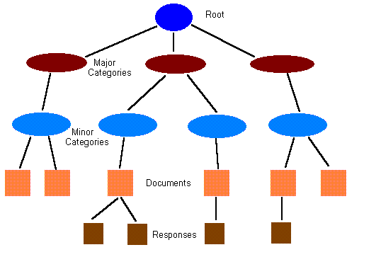

##### Chapter 6-1
##### Structure

<b>Views and Collections</b> 
 
<b>Definitions</b> 
 
A view note stores the rules for: 

<ul type="disc">
<li>Selecting documents from a database 
<li>Organizing the documents 
<li>Presenting information about each document</ul>
 
A collection is an instance of a view at one moment in time. A collection can change as the documents in a database change, even though the view may remain constant. 
 
<b>The Structure of a Collection</b> 
 
A collection has a hierarchical, inverted-tree structure, as shown below. 
 
 
 
 
 
The root of the tree represents the entire collection. Major categories are below the root and can have secondary categories. Below those are any other levels of categories (not shown in the figure). Below the lowest categories are the main-topic documents. Below the main topics are response notes, and below them are responses-to-responses (not shown in the figure) and so on. 
 
A collection always maintains its tree-like structure. If a document is in two categories, the collection contains two nodes for the same document. In other words, a collection does not violate the tree structure by having nodes with more than one parent. 
 
Not all of these levels are required. For example, a view may have no categories at all. There may also be no response documents in the collection, or the collection can be completely empty if the database is empty or the view selection rule matches no documents. 
 
You can use the HCL C API for Domino and Notes to navigate in a collection, finding just the documents you want. You can get a list of only the main-topic documents in a certain category, ignoring any response documents, or you can find only the responses to a certain main topic. You can also get a list of all the documents in a collection, regardless of any categorization.
---
