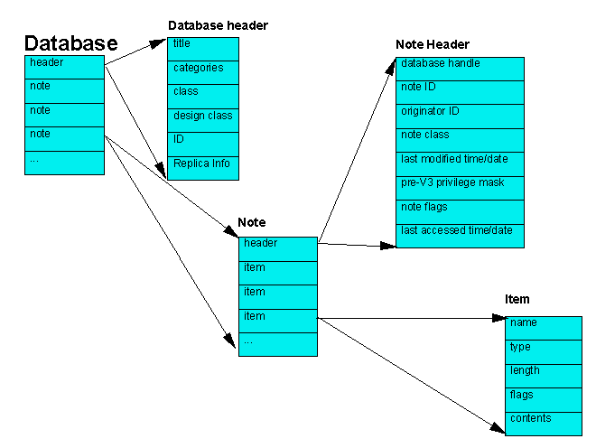

##### Chapter 5-1
##### The Parts of a Domino Database

<b>Structure of a Domino Database</b> 
 
A Domino database consists of database header information followed by a number of notes.  A note is a general structure that Domino and Notes use to hold and organize a variety of information.  Notes include design notes (forms, views, folders, navigators, outlines, pages, framesets, agents, and resources), data documents, profile documents, access control list, and collections (indexes).  A note consists of header information followed by items or fields.  An item consists of several attributes followed by the contents. 
 
The figure below shows the overall structure of a Domino database. It presents a logical view of a Domino database. We do not mean to imply that a database is physically arranged in this way. 

<b>Domino Database Model</b>
 
 
Notes are arranged in no particular order, and there may be any number of each kind of note. The Domino and Notes software makes extensive use of notes to store information. As mentioned previously, the access control list, database design elements, profile documents, and data documents are all stored as notes. Data documents are also referred to as documents or data notes. 
 
In some cases, Domino and Notes use only one instance of a particular kind of note. For example, a database can contain more than one icon note, but only the latest is used. 
 
NOTE: The term &quot;Notes&quot; (capitalized) refers to the Lotus client software product, while the terms &quot;note&quot; and &quot;notes&quot; (lowercase) refer to the data structure in a Domino database. Throughout this book, we use the terms &quot;document&quot; and &quot;data note&quot; interchangeably. 
 
Some C API functions read, write, or copy information in the database header. However, most C API functions manipulate notes, creating, deleting, copying, or modifying them.  
 
In general, the C API gives you: 

<ul type="disc">
<li>Selective access to the database header
<li>The ability to copy intact or delete every kind of note
<li>The ability to read, write, and modify data notes
<li>The ability to read, write, and modify design notes</ul>
 
The figure below presents a high level view of a sample Domino database.
<table width="100%" border="1">
<tr valign="top"><td width="100%"><b>Database Header Information</b>
<ul>
<ul>Title 
Categories 
Class 
ID 
Flags 
Replication Settings 
Replication History 
User Activity Log 
Other header data</ul>
</ul>
</td></tr>

<tr valign="top"><td width="100%"><b>Access Control List</b></td></tr>

<tr valign="top"><td width="100%"><b>Icon Note (Design Note - Resource - Other) </b> 
Contains the database information buffer in the &quot;$TITLE&quot; field.  Also contains advanced database properties in the &quot;$Flags&quot; field (defined in the Icon Flags section of stdnames.h).</td></tr>

<tr valign="top"><td width="100%"><b>Help-Using Document (Design Note - Resource - Other) </b></td></tr>

<tr valign="top"><td width="100%"><b>Help-About Document (Design Note - Resource - Other)</b></td></tr>

<tr valign="top"><td width="100%"><b>View Note (Design Note)</b></td></tr>

<tr valign="top"><td width="100%"><b>View Note (Design Note)</b></td></tr>

<tr valign="top"><td width="100%"><b>Form Note (Design Note)</b></td></tr>

<tr valign="top"><td width="100%"><b>Agent Note (Design Note)</b></td></tr>

<tr valign="top"><td width="100%"><b>Agent Note (Design Note)</b></td></tr>

<tr valign="top"><td width="100%"><b>Data Note (Document)</b></td></tr>

<tr valign="top"><td width="100%"><b>Data Note (Document)</b></td></tr>

<tr valign="top"><td width="100%"><b>Data Note (Document)</b></td></tr>

<tr valign="top"><td width="100%"><b>...</b></td></tr>

<tr valign="top"><td width="100%"><b>Collections (Indexes)</b></td></tr>
</table>
 
 
<b>Character String Input and Output</b> 
 
Domino databases use the Lotus Multi-Byte Character Set (LMBCS).  LMBCS is composed of a set of character &quot;groups&quot;, with the leading byte of each character indicating the group that the character is in. A string may be optimized for a particular group, in which case characters in that group are stripped of their initial byte. LMBCS optimized for Group 1 is the format used for all input and output to the API and is also the format in which all Domino strings are stored internally.  The U.S. ASCII character set is a subset of LMBCS and is optimized for Group 1.  No special processing is needed for U.S. ASCII character string input and output.  You need to use the C API function, OSTranslate, for non U.S ASCII character string input into and output from the C API.
---
